[**Learn Databricks in Under 2
Hours**](https://www.youtube.com/watch?v=CoqZTt528ew)

[**GitHub - AlexTheAnalyst/DatabricksSeries ·
GitHub**](https://github.com/AlexTheAnalyst/DatabricksSeries)

**📌 Video Overview: Learn Databricks in Under 2 Hours**

- Tutorial series summarizes 5 weeks of Databricks learning into one
  structured walkthrough.

- Covers platform overview, data import, SQL, notebooks, AI tools, and a
  full end-to-end project.

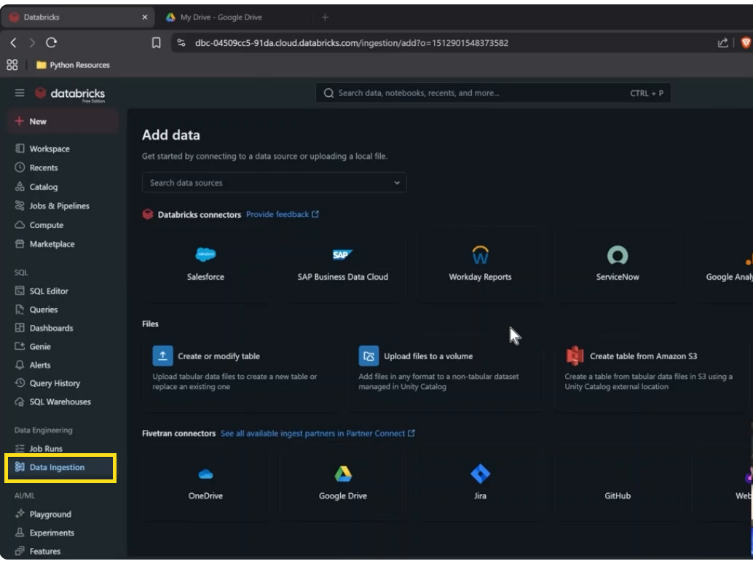

Data Ingestions

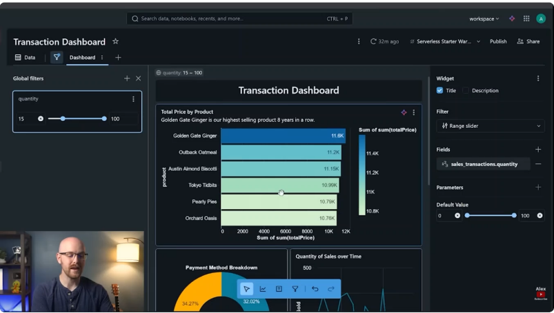

Dash boards

- Uses **Databricks Free Edition** (no credit card required).

> https://login.databricks.com/signup

------------------------------------------------------------------------

**🚀 What is Databricks?**

- Built on **Apache Spark** → optimized for large-scale data processing.

- Designed for collaboration among:

  - Data engineers

  - Data analysts

  - Data scientists

- Enables:

  - Data ingestion

  - Transformation (ETL)

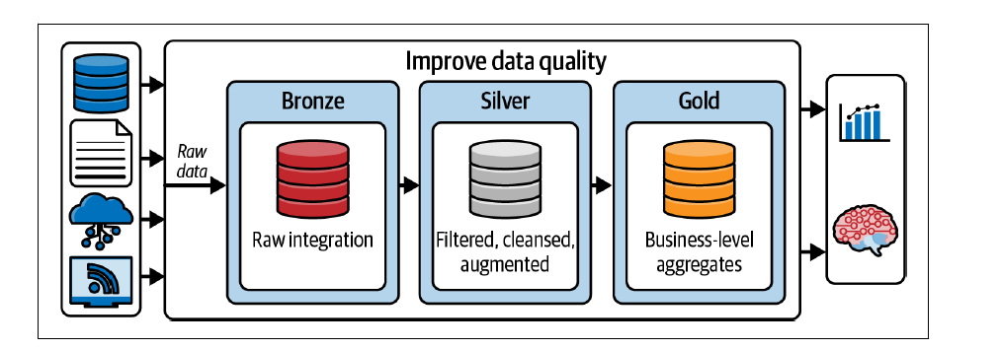

**ETL** stands for **Extract, Transform, Load**. It is the three-step
process used to move data from various sources into a single,
centralized system (like a data warehouse) so it can be analyzed.

**1. Extract (Gathering the Data)**

Data is collected from different sources, such as:

- **SQL databases** (customer info)

- **SaaS apps** (Salesforce, Zendesk)

- **Logs or APIs** (website clicks, weather data)

**2. Transform (Cleaning and Shaping)**

This is the most critical step. Since raw data is often messy or
inconsistent, you "fix" it by:

- **Cleaning:** Removing duplicates or fixing typos.

- **Standardizing:** Ensuring all dates look like YYYY-MM-DD or
  converting currencies.

- **Filtering:** Keeping only the data that matters for business goals.

- **Joining:** Combining data from two different sources into one table.

**3. Load (Storing the Data)**

The final, "clean" data is written into its destination—usually a **Data
Warehouse** (like Snowflake, BigQuery, or Redshift). Once it’s loaded,
business tools can use it to create reports and charts.

- Analysis

- Visualization

- AI & ML development

<!-- -->

- All workflows exist in one unified platform.

------------------------------------------------------------------------

**🆓 Databricks Free Edition**

- Sign up using Google, Microsoft, or email.

- No payment information required.

- Includes:

  - Serverless SQL warehouse

  - AI tools

  - Dashboards

  - SQL & Python notebooks

------------------------------------------------------------------------

**🏢 Core Platform Sections**

**1️⃣
Workspace**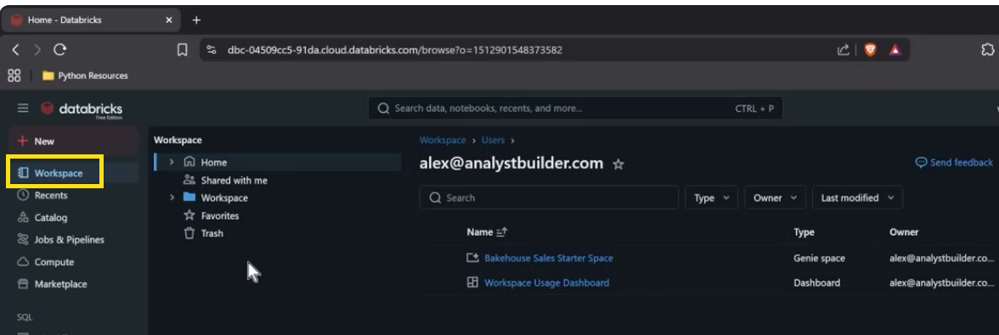

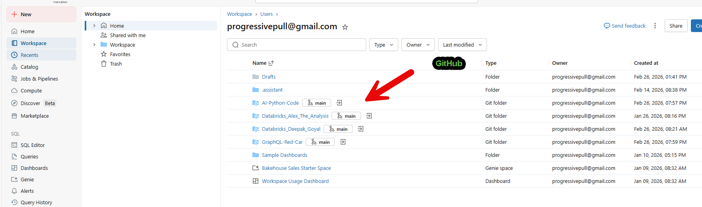

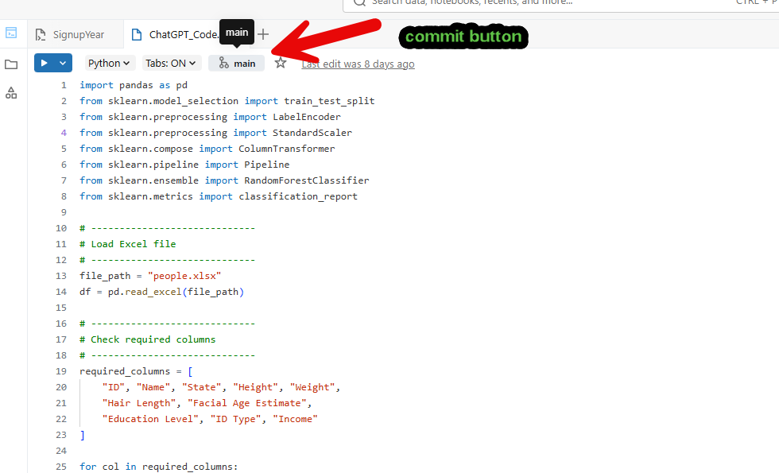

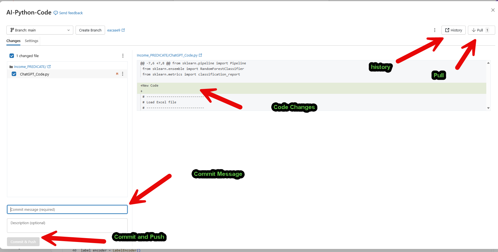

- Main collaboration environment.

- Share code, data, dashboards, and notebooks with teammates.

**2️⃣ Catalog**

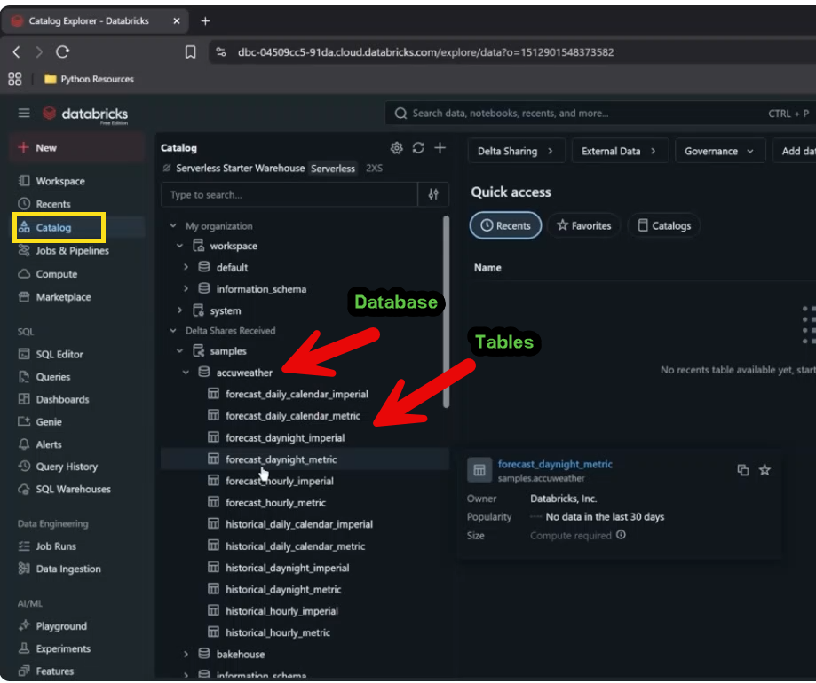

- Similar to a database schema.

- Contains:

  - Databases

  - Tables

  - Views

- Central location to access data assets.

**3️⃣ Jobs & Pipelines (Automation)**

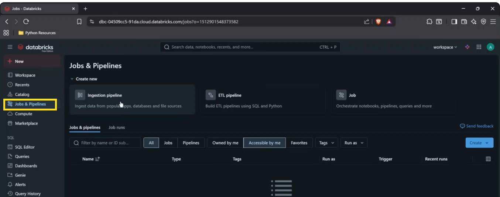

- **Ingestion pipeline** → Extract data.

- **ETL pipeline** → Transform and load data.

- **Jobs** → Schedule and orchestrate pipelines (daily, weekly, etc.).

> **What is a Job in Databricks?**
>
> A **Databricks Job** is a way to **run automated, scheduled, or
> triggered workloads** on Databricks.
>
> In simple terms:

A job is a production workflow that runs notebooks, scripts, SQL
queries, or pipelines on a schedule or in response to an event.

> **Key Characteristics**
>
> **1. Runs Code Automatically**
>
> A job can run:

- 📓 Notebooks

- 🐍 Python scripts

- 🧱 JAR files

- 🗄 SQL queries

- 🔄 Delta Live Tables pipelines

> **2. Can Be Scheduled or Triggered**
>
> Jobs can run:

- On a **schedule** (e.g., daily at 2 AM)

- On **demand**

- When triggered by an **API call**

- Based on a **file arrival or event**

> **3. Runs on a Cluster**
>
> Each job runs on:

- A **new job cluster** (created just for that job run), or

- An **existing all-purpose cluster**

> Best practice: Use **job clusters** for production workloads.
>
> **4. Supports Workflows (Multi-Task Jobs)**
>
> Databricks Jobs can contain:

- Multiple tasks

- Task dependencies

- Parallel execution

- Conditional execution

> Example workflow:

1.  Ingest raw data

2.  Transform data

3.  Load into a data warehouse

4.  Send notification

> **Why Use Jobs?**
>
> You use Jobs in Databricks to:

- Automate ETL pipelines

- Run production ML models

- Schedule reports

- Orchestrate data workflows

> **Simple Example**
>
> Instead of manually running a notebook every night:

- Create a Job

- Attach the notebook

- Schedule it for 1:00 AM daily

> Databricks will handle execution automatically.

**4️⃣ Compute**

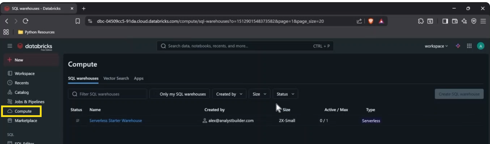

- Free Edition includes:

  - Serverless Starter Warehouse (2X small).

- Automatically activates when running queries.

- Separate compute used for Python notebooks.

> [Databricks Compute Options Explained: All-Purpose, Job, Serverless &
> SQL Warehouses](https://www.youtube.com/watch?v=_cCGMBd0bgg)

------------------------------------------------------------------------

**🔌 Marketplace & Integrations**

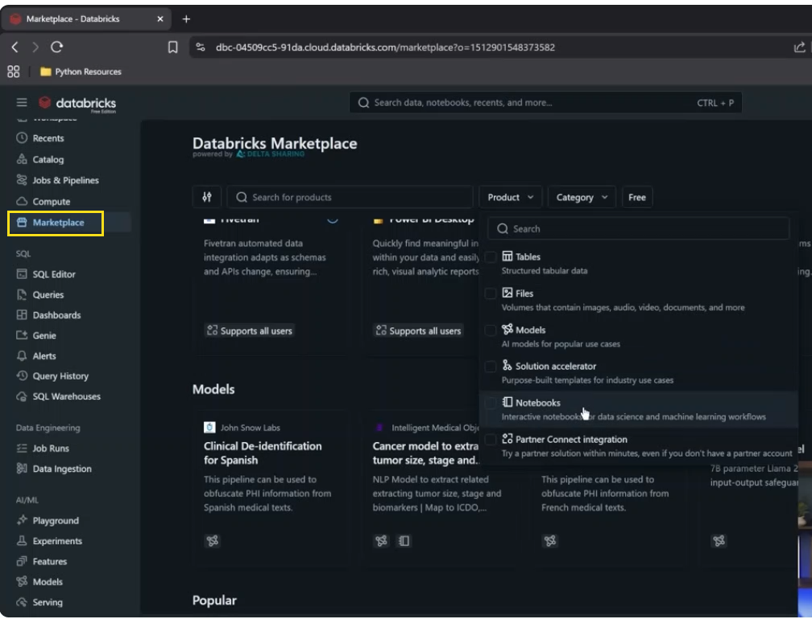

- Connect easily to tools like:

  - Power BI

  - Tableau

  - DBT

  - Fivetran

- Access free datasets, models, and notebooks.

- Can also import external data (e.g., Kaggle).

  - [Kaggle: Your Machine Learning and Data Science
    Community](https://www.kaggle.com/)

------------------------------------------------------------------------

**💻 SQL & Data Analysis**

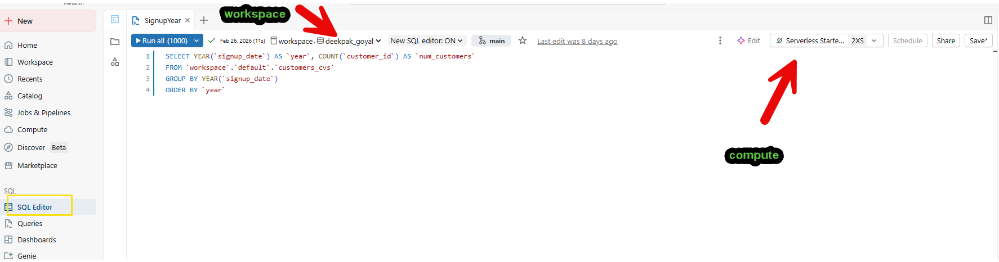

**SQL Editor**

- Write SQL queries.

- Multiple tabs supported.

- AI-assisted query writing.

**Query Management**

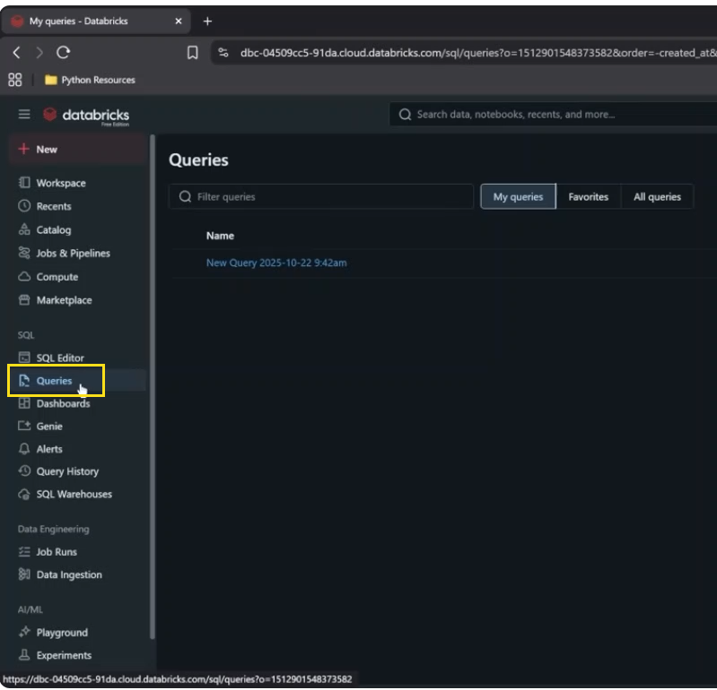

- Save and organize queries inside Databricks.

- Eliminates need to store SQL files externally.

------------------------------------------------------------------------

**📊 Dashboards & Visualization**

- Build interactive dashboards.

- Create visualizations directly from data in Databricks.

- Drill-down capabilities.

- Fully integrated with SQL warehouse.

------------------------------------------------------------------------

**🤖 AI Features**

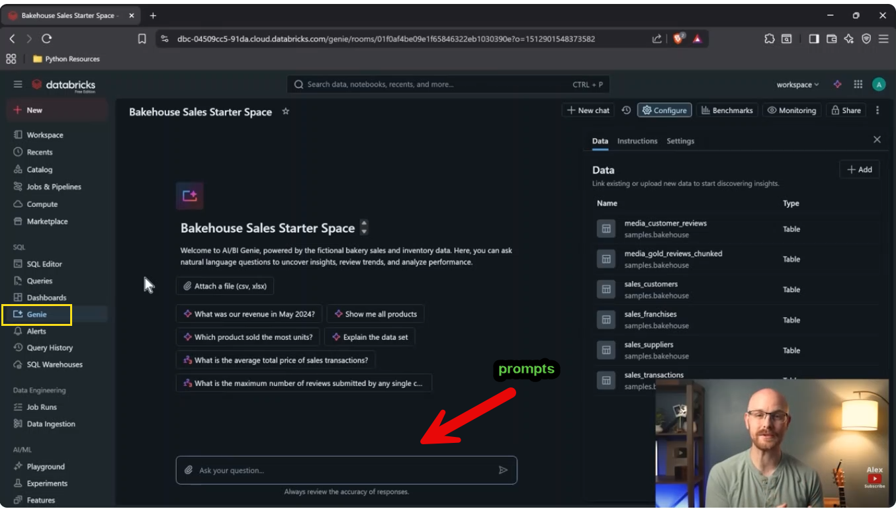

**Genie (AI Query Tool)**

- Use natural language to query data.

- Generates SQL automatically.

- Speeds up analysis and insights.

**Databricks Assistant**

- AI coding help inside notebooks and SQL editor.

**AI & ML Section**

- Playground for prompt experimentation.

- Build and test machine learning models.

- Create AI agents.

- Run experiments and deploy models.

------------------------------------------------------------------------

**🔔 Alerts**

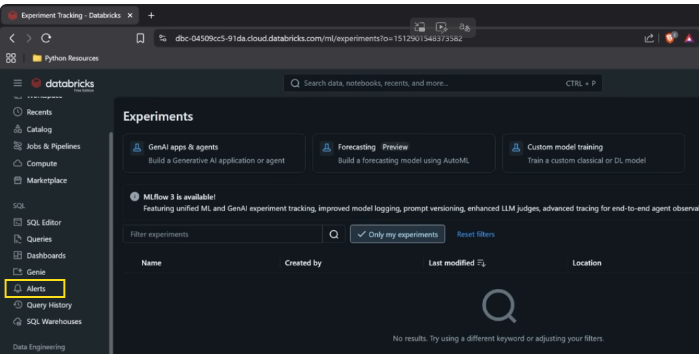

- Create condition-based triggers.

- Send notifications when data conditions are met.

------------------------------------------------------------------------

**📥 Data Ingestion**

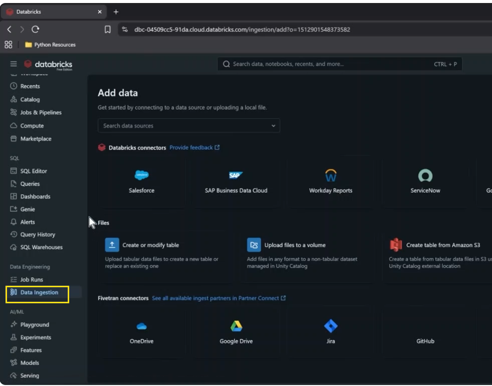

- Upload files (CSV, JSON).

- Connect to external data sources (e.g., Google Analytics).

**Playground**

**🔹 What It Is**

Databricks Playground is a **prompt testing and model experimentation
interface** that lets you:

- Interact with foundation models (LLMs)

- Test prompts in real time

- Adjust parameters (temperature, max tokens, etc.)

- Compare model responses

- Prototype GenAI applications before production

It’s mainly used in **Databricks Mosaic AI** workflows.

------------------------------------------------------------------------

**🔹 What You Can Do in Playground**

**1. Prompt Engineering**

- Write and refine prompts

- Try system/user message formats

- Test instruction-following behavior

- Experiment with few-shot examples

**2. Adjust Model Settings**

- Temperature (creativity vs determinism)

- Max tokens (response length)

- Top-p sampling

- Stop sequences

**3. Compare Models**

- Try different foundation models

- Evaluate output quality

- Test performance vs cost

**4. Generate Code or Data Insights**

- SQL generation

- Python code generation

- Data summarization

- Text classification

- Q&A over structured or unstructured data

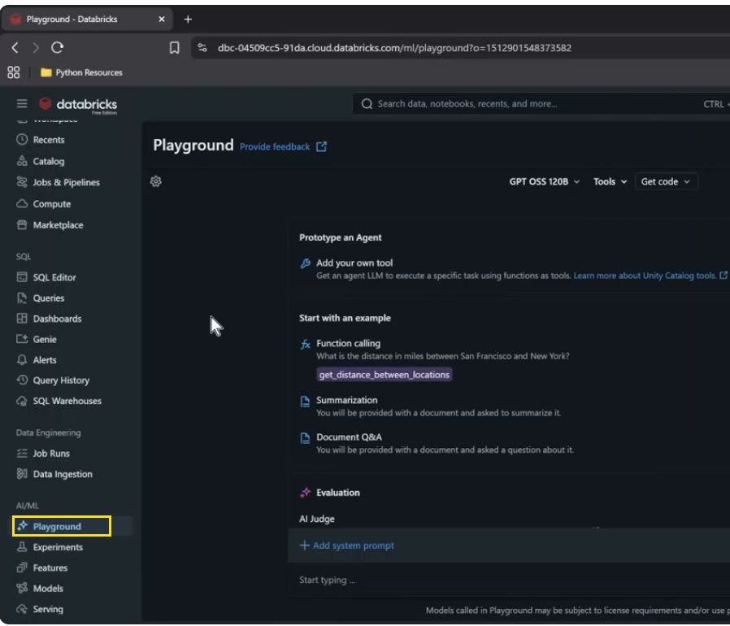

**Experiments**

## **Databricks Experiments** 

- Databricks Experiments are used to track, organize, and **compare
  machine learning** runs.

- They are part of MLflow, which is built into Databricks.

- Think of Experiments as a structured lab notebook for ML projects.

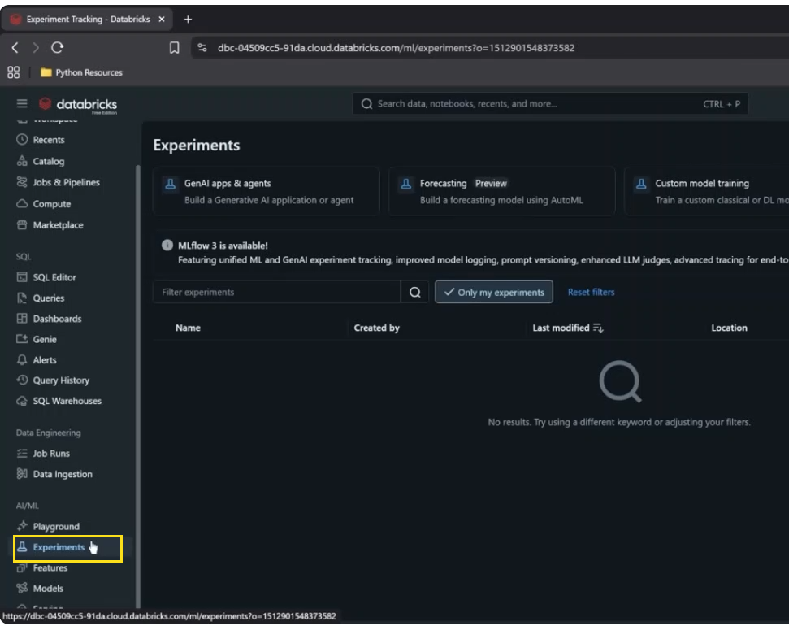

------------------------------------------------------------------------

**🛠 What the Course Will Cover**

- Platform walkthrough

- Importing flat files & external data sources

- Writing SQL queries

- Using notebooks (Python & SQL)

- Building dashboards

- Leveraging AI tools (Genie & Assistant)

- Creating pipelines and automation

- Final hands-on full project

------------------------------------------------------------------------

**🎯 Key Takeaways**

- Databricks is an all-in-one data platform.

- Combines engineering, analytics, visualization, and AI.

- Free Edition makes it accessible for learning.

- Strong focus on collaboration and automation.

- AI integration significantly speeds up workflows.
