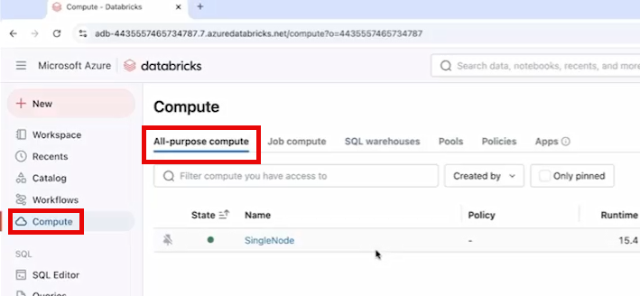
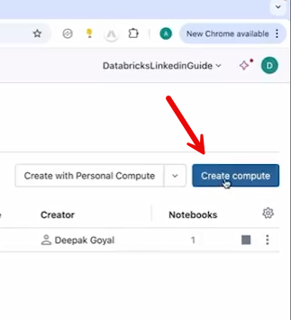
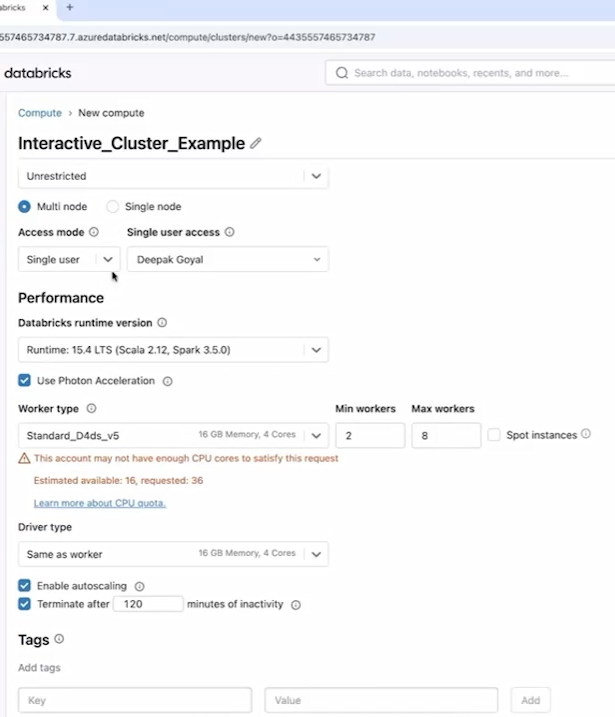
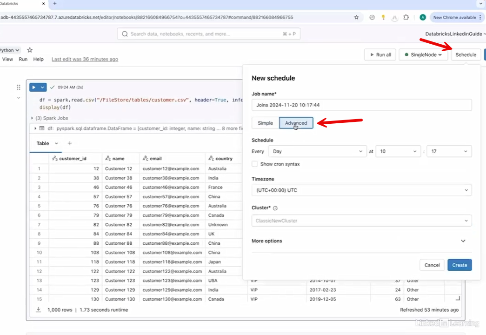
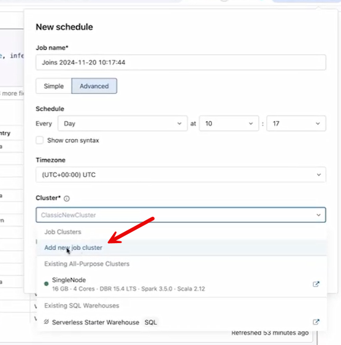
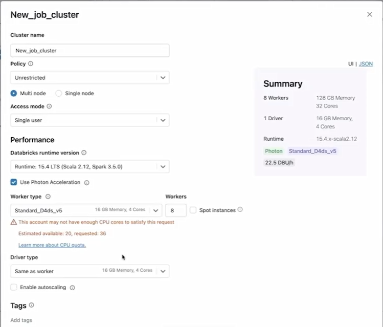

**10. Cluster Management in Databricks**

10.1 Understand the interactive cluster

**Interactive Cluster**

An **interactive cluster** is a core component in Databricks that
provides the **compute power needed to run notebooks**. It is mainly
used for **development, exploration, and ad hoc analysis**.

**Key Characteristics:**

- **Interactive Execution**

  - Run notebook cells one at a time.

  - Enables step-by-step exploration and analysis.

- **Persistent State**

  - Data, variables, and computations remain available as long as the
    cluster is running.

- **Collaboration**

  - Multiple users and notebooks can share the same cluster.

  - Ideal for team-based development.

- **Flexible Configuration**

  - Easily scale cluster size (e.g., 2 nodes to 20 nodes) based on
    workload needs.

- **Notebook Attachment**

  - Clusters can be attached to notebooks for execution.

**Cost Consideration:**

- Clusters are **expensive** because they provide compute power.

- Use **auto-termination** to avoid unnecessary costs:

  - Automatically shuts down the cluster after a period of inactivity
    (e.g., 30 or 120 minutes).

------------------------------------------------------------------------

**Bottom Line:**

Interactive clusters are best for **real-time development,
experimentation, and collaboration**, but must be managed carefully to
**control costs**.

10.2 Explore cluster configuration and the UI

**Cluster Configuration & UI**

In Databricks, interactive clusters are created and managed through the
**Compute tab** (also called *All-Purpose Compute*).

**Creating a Cluster:**

- Go to **Compute → Create Compute**

>  alt="Graphical user interface, text, application, email AI-generated content may be incorrect." />

- Provide a **cluster name**

- (Optional) Apply **policies** based on permissions

**Key Configuration Options:**

- **Cluster Type**

  - **Single-node**: for testing or small workloads

  - **Multi-node**: for large-scale or production workloads

- **Access Mode**

  - Single user or shared across multiple users

- **Databricks Runtime Version**

  - Defines the software environment (e.g., version 15.4 or latest)

- **Photon Acceleration**

  - Speeds up heavy computations (comes with additional cost)

- **Node Configuration**

  - **Driver node** (1 machine)

  - **Worker nodes** (multiple machines)

  - Choose CPU, memory, and instance type

- **Autoscaling**

  - Automatically adjusts number of worker nodes (e.g., 2–8)

  - Helps optimize performance and cost

- **Auto-Termination**

  - Shuts down cluster after inactivity (e.g., 60–120 minutes)

  - Prevents unnecessary costs

- **Advanced Settings**

  - Configure Spark settings or environment paths if needed

**Important Note:**

- Interactive clusters must be **manually started and stopped**.

- Unlike job clusters, they do not automatically manage their lifecycle.

------------------------------------------------------------------------

**Bottom Line:**

Databricks cluster configuration provides **flexibility, scalability,
and cost control**, but interactive clusters require **manual
management** and careful setup to optimize performance and expenses.

10.3 Understand job clusters

**Job Clusters**

A **job cluster** is a cluster type designed to **run a specific job or
notebook automatically**. It is **temporary, task-specific, and fully
managed by Databricks**.

**Key Characteristics:**

- **Automatic Lifecycle**

  - Starts automatically when a job begins.

  - Terminates automatically after the job completes.

  - No manual start/stop required.

- **Dedicated to a Single Job**

  - Each job gets its **own cluster**.

  - Multiple jobs = multiple isolated clusters.

- **Temporary Nature**

  - Created fresh for each run.

  - Cannot be reused or restarted after termination.

- **Isolated Environment**

  - Each job runs independently without interference from others.

- **Configurable**

  - Users can define cluster settings (node type, size, configs), but
    execution is managed by Databricks.

**Benefits:**

- **Cost Efficient**

  - Runs only during execution → no idle cost.

- **Optimized Performance**

  - Tailored specifically for each job.

**Job Cluster vs Interactive Cluster:**

| **Feature** | **Interactive Cluster**         | **Job Cluster**                |
|-------------|---------------------------------|--------------------------------|
| Purpose     | Development & exploration       | Specific job execution         |
| Lifecycle   | Manual (user-managed)           | Automatic (Databricks-managed) |
| Persistence | Persistent                      | Temporary                      |
| Sharing     | Shared across users & notebooks | Dedicated to one job           |
| Cost        | Higher (can idle)               | Lower (runs only when needed)  |

**Where to Configure:**

- While scheduling a notebook:

- Select **“Add New Job Cluster”**

>  alt="Graphical user interface, text, application, email AI-generated content may be incorrect." />

- Define:

  - Cluster name

  - Single-node or multi-node

  - Driver & worker configuration

  - Advanced settings (env variables, libraries)

>  alt="Graphical user interface, application AI-generated content may be incorrect." />

------------------------------------------------------------------------

**Bottom Line:**

Job clusters are ideal for **automated, scheduled workloads** because
they are **efficient, isolated, and fully managed**, making them more
cost-effective than interactive clusters for production jobs.

# [Content](./../content.md)
