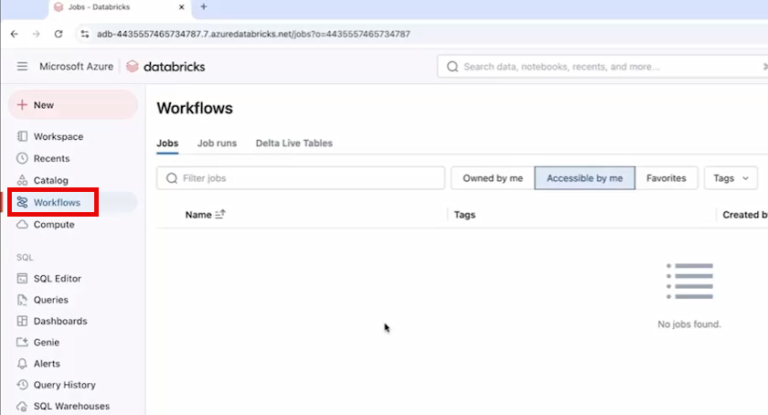
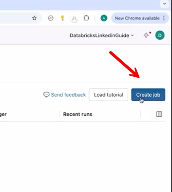
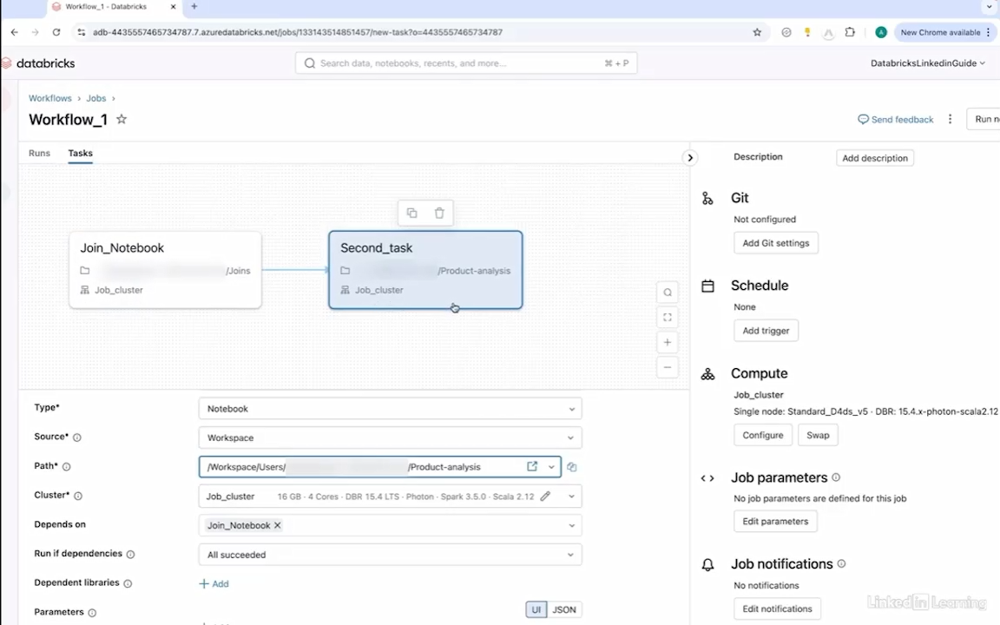
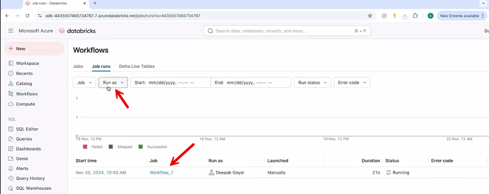

**11. Workflows in Databricks**

11.1 Understand workflows in Databricks

**Workflows in Databricks**

A **workflow** is an **orchestrated sequence of tasks** executed in a
defined order. It is used to automate and manage processes like **data
pipelines, ML workflows, or job chains**.

**Key Components:**

- **Tasks**

  - Small units of work (e.g., notebook, Python script, SQL query).

- **Dependencies**

  - Define execution order (e.g., Task 2 runs only after Task 1
    completes).

- **Cluster Management**

  - Each task can use its own **job cluster** for execution.

- **Parameters**

  - Tasks can pass outputs as inputs to other tasks.

- **Monitoring & Logging**

  - Track execution status and view history in one place.

- **Error Handling**

  - Supports retries and failure handling for robustness.

**Key Features / Benefits:**

- **Task Orchestration**

  - Build structured, multi-step workflows.

- **Automation & Scheduling**

  - Run workflows at specific times or based on triggers.

- **Resource Optimization**

  - Efficient use of clusters (via job clusters per task).

- **Reliability**

  - Retry mechanisms handle transient failures.

- **Centralized Monitoring**

  - Easily track performance and execution history.

------------------------------------------------------------------------

**Bottom Line:**

Workflows in Databricks allow you to **chain, automate, and manage
multiple tasks efficiently**, making them essential for building
**scalable and reliable data pipelines**.

11.2 Create a workflow in Databricks

**Creating a Workflow**

Workflows in Databricks are created using the **Workflows (Jobs) tab**,
where you define and orchestrate multiple tasks.

**Steps to Create a Workflow:**

1.  Go to **Workflows tab → Create Job**

>  alt="Graphical user interface, text, application, email AI-generated content may be incorrect." />

2.  Give the workflow a **name** (e.g., *Workflow_1*)

**Adding Tasks:**

- Click **Add Task**

- Define:

  - **Task name** (e.g., *Join_Notebook*)

  - **Task type** (Notebook, Python, SQL, etc.)

  - **Source** (workspace path of the notebook/script)

  - **Cluster** (select or create a **job cluster**)

- (Optional):

  - Add **parameters**

  - Add **libraries**

  - Configure **retry/error handling**

  - Set **notifications**

**Task Orchestration:**

- Add multiple tasks using **Add Task**

- Define execution order (e.g., Task 2 runs after Task 1)

- Example:

  - Task 1: Run *Join_Notebook*

  - Task 2: Run *Product-analysis* notebook after Task 1

**Additional Settings:**

- **Triggers/Scheduling**: Run workflow at specific times

- **Permissions**: Control access for other users

**Running & Monitoring:**

- Click **Run Now** to execute the workflow

- Use **View Run / Job Runs** to:

  - Monitor execution

  - Check logs

  - Debug errors

**Error Example:**

- Workflow may fail if issues occur (e.g., trying to create an already
  existing table)

- Logs help identify and fix problems

- Subsequent tasks only run if prior tasks succeed

------------------------------------------------------------------------

**Bottom Line:**

Creating workflows in Databricks allows you to **automate multi-step
processes**, **chain tasks together**, and **monitor execution**, making
it a powerful tool for building end-to-end data pipelines.

------------------------------------------------------------------------

**Notes:**

The terms **workflows** and **ETL pipelines** in Databricks are related
but not the same thing—they operate at different levels of abstraction.

**Big picture**

- **ETL pipelines** = *what data processing logic does* (extract,
  transform, load)

- **Workflows** = *how tasks (including ETL jobs) are orchestrated and
  scheduled*

------------------------------------------------------------------------

**🔹 ETL Pipelines in Databricks**

An ETL pipeline is about **data movement and transformation**.

**What it includes:**

- Reading data (from S3, ADLS, databases, APIs)

- Transforming data (cleaning, aggregating, joining)

- Writing results (Delta tables, warehouses, etc.)

**In Databricks specifically:**

- Often built using:

  - **Delta Live Tables (DLT)** (managed pipelines)

  - Notebooks (PySpark / SQL)

  - Structured Streaming (for real-time pipelines)

**Key characteristics:**

- Focused on **data logic**

- Defines **data dependencies**

- Handles **data quality, lineage, incremental updates**

👉 Example:

- Ingest raw logs → clean → aggregate → store in Delta table

------------------------------------------------------------------------

**🔹 Workflows in Databricks**

A Workflow is about **orchestration and automation**.

**What it does:**

- Schedules jobs

- Runs tasks in order (or parallel)

- Handles retries, failures, dependencies

- Coordinates multiple pipelines or jobs

**Tasks inside a workflow can be:**

- Notebooks

- Python scripts

- SQL queries

- DLT pipelines

- JAR jobs

**Key characteristics:**

- Focused on **execution control**

- Defines **task dependencies (DAG)**

- Handles **scheduling & monitoring**

👉 Example:

- Run ingestion notebook → then transformation notebook → then ML
  training → then send alert

------------------------------------------------------------------------

**🔑 Core Differences**

| **Aspect** | **ETL Pipeline** | **Workflow** |
|----|----|----|
| Purpose | Data processing | Job orchestration |
| Focus | Data transformations | Task scheduling & coordination |
| Level | Logical/data layer | Control/execution layer |
| Tools | DLT, Spark, SQL | Databricks Workflows |
| Dependency type | Data dependencies | Task dependencies |
| Example | Clean and aggregate sales data | Run ETL daily at 2 AM + notify on failure |

------------------------------------------------------------------------

**🧠 How they work together**

In practice, you **combine them**:

- ETL pipeline = the actual data processing logic

- Workflow = runs that pipeline on a schedule and manages dependencies

👉 Common pattern:

- A **Workflow** triggers a **DLT pipeline** or notebook ETL job daily

------------------------------------------------------------------------

**🟢 Simple analogy**

- **ETL pipeline** = recipe (how to cook the meal)

- **Workflow** = kitchen manager (when to cook, in what order, and what
  happens if something fails)
  
  
 # [Context](./../context.md)
