# **12. dbutils in Databricks**

12.1 What is dbutils in Databricks?

**dbutils in Databricks**

**dbutils** is a **built-in utility library** in Databricks that
provides ready-to-use functions for working with **files, notebooks,
parameters, and secrets**, making notebooks more powerful and
interactive.

**Key Features:**

- **File System Management (dbutils.fs)**

  - Copy, move, delete, and manage files.

- **Notebook Utilities (dbutils.notebook)**

  - Run one notebook from another.

  - Pass parameters and share outputs between notebooks.

- **Widgets (dbutils.widgets)**

  - Add interactive elements (text boxes, dropdowns, multiselect).

  - Enable parameterized and dynamic notebooks.

- **Secrets Management (dbutils.secrets)**

  - Securely store and access sensitive data (passwords, credentials).

- **Help Utility (dbutils.help)**

  - Provides documentation for dbutils commands.

**Benefits:**

- **Simplifies development**

  - Reduces need for custom code.

- **Improves productivity**

  - Built-in tools handle common tasks.

- **Enhances security**

  - Secure handling of sensitive information.

- **Supports dynamic workflows**

  - Enables parameter-driven execution.

**Limitations:**

- **Databricks-specific**

  - Not available outside Databricks (e.g., plain PySpark environments).

- **Potential performance impact**

  - Overuse (e.g., excessive notebook chaining or widgets) may slow
    execution.

------------------------------------------------------------------------

**Bottom Line:**

dbutils is a powerful utility that **simplifies common tasks, enhances
interactivity, and improves productivity** in Databricks—but should be
used thoughtfully due to its **platform dependency and performance
considerations**.

12.2 dbutils fs commands

**dbutils.fs Commands**

The **dbutils.fs module** provides utilities to manage the **Databricks
File System (DBFS)**, allowing you to perform common file operations
directly from notebooks.

**How to Use:**

- **Function style**: dbutils.fs.\<command\>()

- **Magic command style**: %fs \<command\>

------------------------------------------------------------------------

**Common Commands:**

- **Help**

  - dbutils.help() - sed to display a summary of all
    available **Databricks Utilities (dbutils)** modules

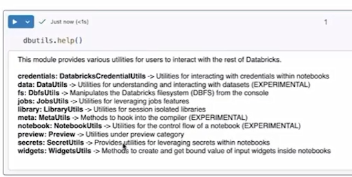

- dbutils.fs.help() → Lists all available file system commands

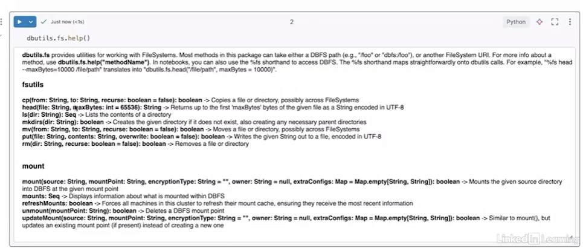

- **Create Directory**

  - dbutils.fs.mkdirs(path)

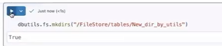

- Creates a new folder in DBFS

<!-- -->

- **List Files**

  - dbutils.fs.ls(path)

  - Displays files and directories in a given location

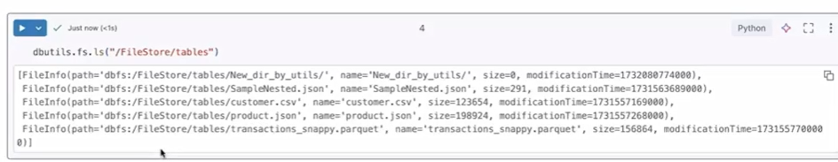

- **Copy Files**

  - dbutils.fs.cp(source, destination, recurse)

  - Copies files or directories

  - recurse=True for copying folders with subfolders

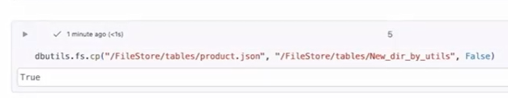

- **Move Files**

  - dbutils.fs.mv(source, destination)

  - Moves files or directories

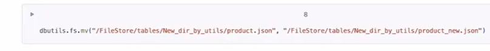

- **Remove Files**

  - dbutils.fs.rm(path, recurse)

  - Deletes files or directories

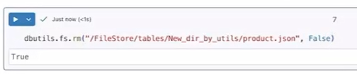

------------------------------------------------------------------------

**Magic Commands (%fs):**

- Alternative syntax for file operations:

  - %fs ls /path

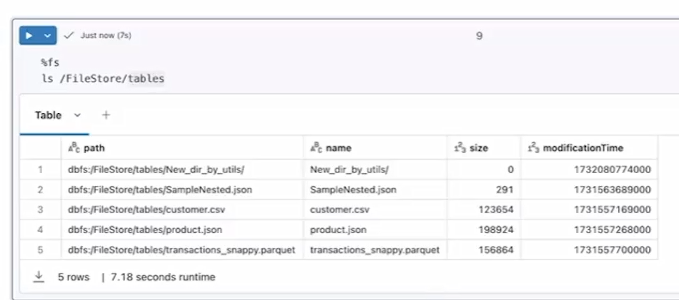

- %fs mkdirs /path

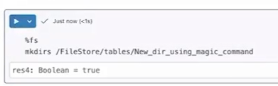

- %fs cp source destination

<!-- -->

- Easier and more shell-like for quick operations

------------------------------------------------------------------------

**Key Benefits:**

- Simplifies file handling in DBFS

- Supports both programmatic and command-style usage

- Useful for managing data in pipelines and notebooks

------------------------------------------------------------------------

**Bottom Line:**

dbutils.fs provides a **simple and powerful interface for file system
operations in Databricks**, making it easy to **create, list, copy,
move, and delete files and directories** directly within notebooks.

12.3 dbutils mounting

**dbutils Mounting**

**Mounting** is a technique used to **connect external storage (e.g.,
Azure Data Lake, S3, GCS)** to Databricks so it can be accessed like
part of the Databricks File System (DBFS).

------------------------------------------------------------------------

**How Mounting Works:**

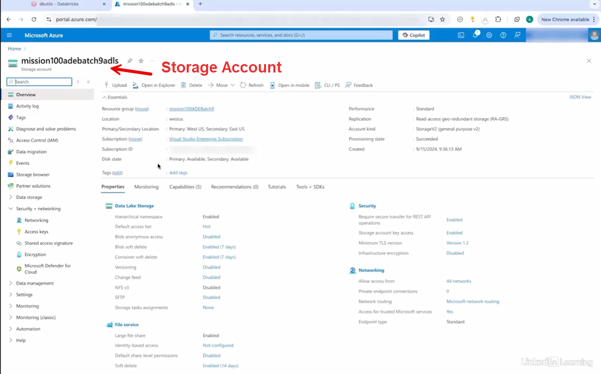

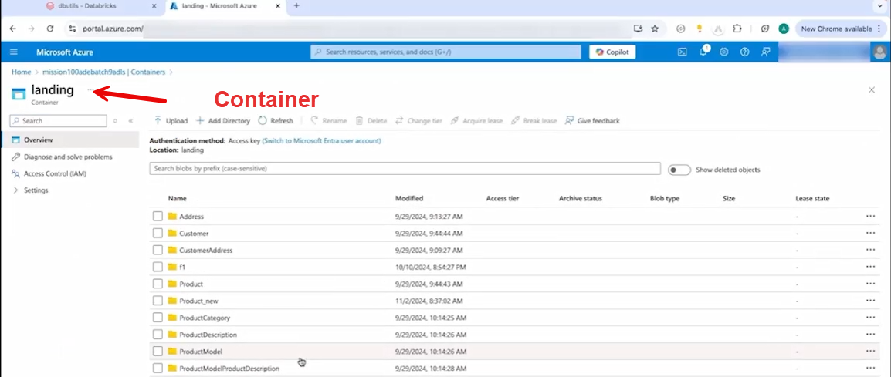

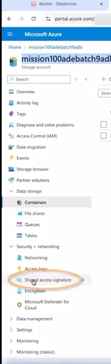

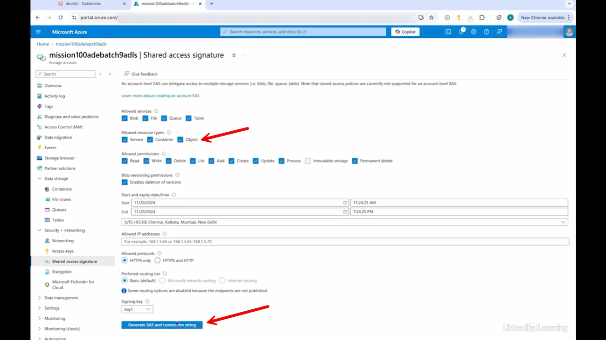

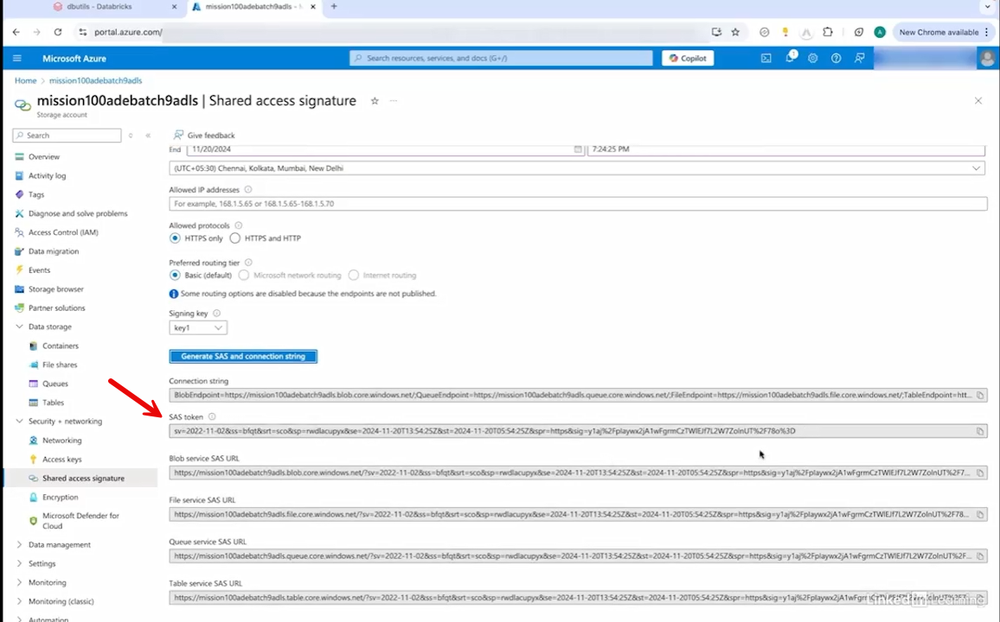

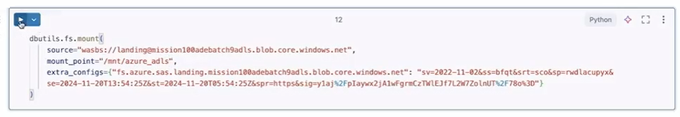

- Use dbutils.fs.mount() to connect external storage

- Provide:

  - **Storage path** (container + storage account)

  - **Mount point** (custom DBFS path like /mnt/azure_adls)

  - **Credentials** (e.g., SAS token)

------------------------------------------------------------------------

**Key Steps:**

1.  Define mount:

    - dbutils.fs.mount(source, mount_point, extra_configs)

2.  Assign a **mount point name** (e.g., /mnt/azure_adls)

3.  Provide **authentication** (e.g., SAS token)

4.  Execute mount (one-time setup)

------------------------------------------------------------------------

**Accessing Mounted Data:**

- Use the mount path like local storage:

  - %fs ls /mnt/azure_adls

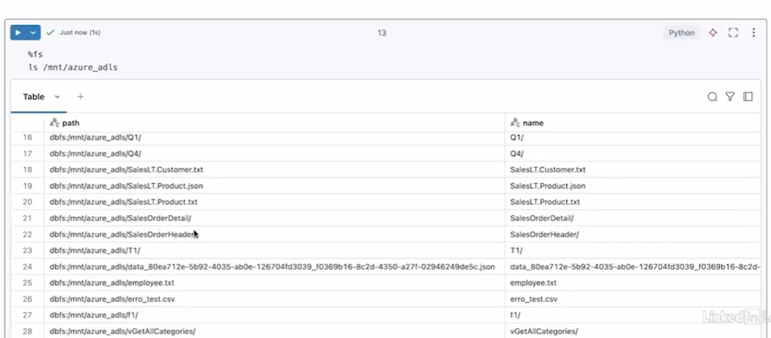

- spark.read.csv("/mnt/azure_adls/file.csv")

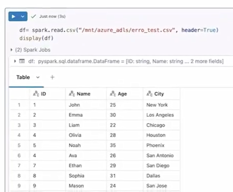

------------------------------------------------------------------------

**Key Features:**

- **Seamless Access**

  - External data appears like local DBFS files

- **One-Time Setup**

  - No need to re-authenticate after cluster restart

- **Simplified Paths**

  - Avoid repeatedly passing credentials

------------------------------------------------------------------------

**Management Commands:**

- **List mounts**

  - dbutils.fs.mounts()

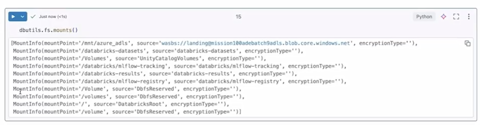

- **Unmount**

  - dbutils.fs.unmount("/mnt/azure_adls")

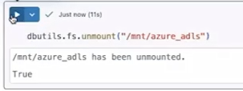

------------------------------------------------------------------------

**Benefits:**

- Easy integration with cloud storage

- Simplifies data access in pipelines

- Improves productivity by abstracting credentials

------------------------------------------------------------------------

**Bottom Line:**

Mounting in Databricks allows you to **securely and seamlessly access
external storage using simple paths**, making it easier to work with
cloud data as if it were local.

12.4 dbutils notebook

**dbutils.notebook**

**dbutils.notebook** is a utility that allows you to **run one notebook
from another**, enabling modular and reusable workflows.

**Key Functions:**

- **Run a Notebook**

  - dbutils.notebook.run(path, timeout, parameters)

  - Calls another notebook and waits for its execution

  - Returns the output from the called notebook

- **Return Output**

  - dbutils.notebook.exit(value)

  - Sends a result (e.g., count, status) back to the calling notebook

------------------------------------------------------------------------

**How It Works:**

1.  **Child Notebook**

    - Performs a task (e.g., read data, compute result)

    - Uses dbutils.notebook.exit() to return output

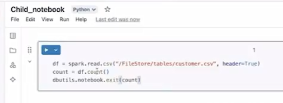

2.  **Parent Notebook**

> 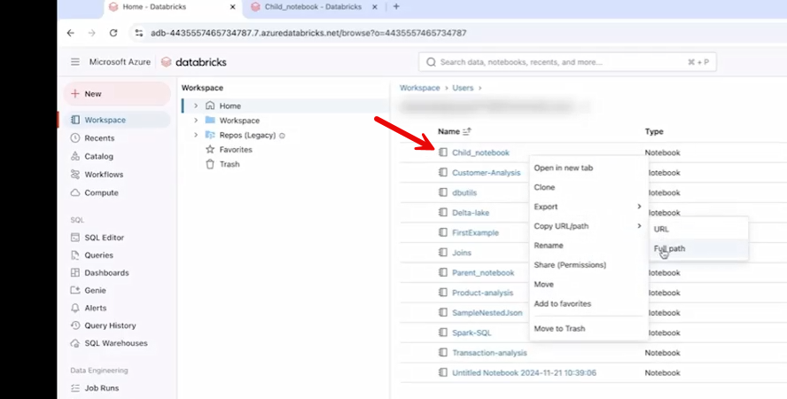 alt="Graphical user interface, text, application, email AI-generated content may be incorrect." />

- Calls child notebook using dbutils.notebook.run()

- Receives and uses the returned result

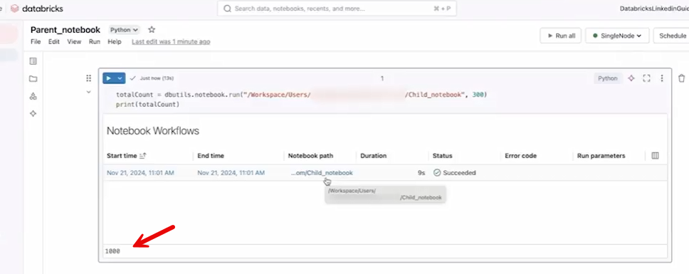

------------------------------------------------------------------------

**Parameter Passing:**

- Pass inputs using a dictionary:

  - dbutils.notebook.run(path, timeout, {"param": "value"})

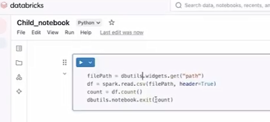

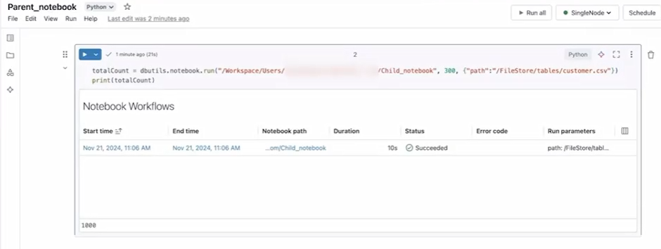

- Retrieve parameters in child notebook:

  - dbutils.widgets.get("param")

------------------------------------------------------------------------

**Use Cases:**

- Modular pipeline design

- Reusing common logic across notebooks

- Passing data/results between notebooks

- Building workflow-like chaining manually

------------------------------------------------------------------------

**Benefits:**

- Improves code reusability

- Enables notebook orchestration

- Supports parameterized execution

------------------------------------------------------------------------

**Bottom Line:**

dbutils.notebook allows you to **chain notebooks, pass parameters, and
return results**, making it a powerful tool for building **modular and
dynamic data workflows** in Databricks.

**Notes:**

**What %fs is**

%fs is a **magic command** (Databricks-specific, not standard Jupyter)
used to interact with the **filesystem** (DBFS — Databricks File
System).

It lets you run file system commands directly in a notebook cell,
similar to using a terminal.

------------------------------------------------------------------------

**Common %fs commands**

Here are the most useful ones:

- **List files**

**%fs**

``` 

%fs ls /FileStore/

```

- **Make directory**

**%fs**

``` 

%fs mkdirs /FileStore/my_folder

```

- **Copy files**

**%fs**

``` 

%fs cp /FileStore/file1.csv /FileStore/file2.csv

```

- **Move files**

**%fs**

``` 

%fs mv /FileStore/file1.csv /FileStore/archive/file1.csv

```

- **Remove files**

**%fs**

``` 

%fs rm /FileStore/file1.csv

```

- **View file contents**

**%fs**

``` 

%fs head /FileStore/file1.csv

```

------------------------------------------------------------------------

**When you use it**

You typically use %fs when:

- Working in **Databricks notebooks**

- Managing files in **DBFS**

- Preparing data for Spark jobs

------------------------------------------------------------------------

**Important note**

- %fs **does NOT work in standard Jupyter Notebook** (like local
  Anaconda/JupyterLab).

- In regular Jupyter, you’d use:

  - Python (os, shutil, pathlib)

  - Or shell commands with ! (e.g., !ls, !cp)

------------------------------------------------------------------------

**Quick comparison**

| **Environment**  | **File commands** |
|------------------|-------------------|
| Databricks       | %fs               |
| Jupyter Notebook | !ls, Python       |

Below is a clean mapping from %fs → Python equivalents.

------------------------------------------------------------------------

**🧠 Core idea**

%fs works with files → in Python you use:

- os (basic operations)

- shutil (copy/move/delete)

- pathlib (modern, cleaner approach)

------------------------------------------------------------------------

**🔁 %fs → Python equivalents**

**1. List files**

**%fs**

```

**%fs**

%fs ls /FileStore/

```

**Python**

``` python

import os  
  
os.listdir("/FileStore/")

```

👉 Better (with full paths):

**Python**

``` python

from pathlib import Path  
  
list(Path("/FileStore/").iterdir())

```

**✅ Quick mental mapping**

| **%fs command** | **Python equivalent**         |
|-----------------|-------------------------------|
| ls              | os.listdir() / Path.iterdir() |
| mkdirs          | os.makedirs()                 |
| cp              | shutil.copy()                 |
| mv              | shutil.move()                 |
| rm              | os.remove() / shutil.rmtree() |
| head            | open()                        |

# [Content](./../content.md)