# **14. Capstone Project**

**14.1 Project use case**

**📊 Project: Retail Sales Analysis for Store Optimization**

**🎯 Objective**

- Clean, prepare, and analyze sales + store data

- Generate insights to improve store performance and product trends

------------------------------------------------------------------------

**📁 Datasets**

1.  **Sales Data (CSV)**

    - Columns: sales_id, store_id, product_id, sale_date, quantity,
      total_amount

2.  **Store Data (CSV)**

    - Columns: store_id, store_region, store_size, open_date

------------------------------------------------------------------------

**🧹 Data Cleaning**

- Handle missing (null) values

- Remove duplicates and invalid rows

- Standardize date formats

------------------------------------------------------------------------

**🔄 Data Transformation**

- Join sales and store datasets (on store_id)

- Create new columns:

  - **Sales per square foot** = total_amount / store_size

  - **Sale year** (extracted from sale_date)

- Aggregate:

  - Total sales and quantity by **store** and **region**

------------------------------------------------------------------------

**📈 Analysis**

- Top 5 stores by total sales

- Top 5 products by total quantity sold

------------------------------------------------------------------------

**💾 Output**

- Save final results in **Parquet format**

**14.2 Solution**

**🚀 Project Execution Summary (Databricks + PySpark)**

**📥 1. Data Loading**

- Uploaded sales_data.csv and store_data.csv to **DBFS**

> 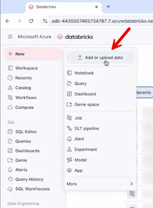 alt="Graphical user interface, application AI-generated content may be incorrect." />
>
> 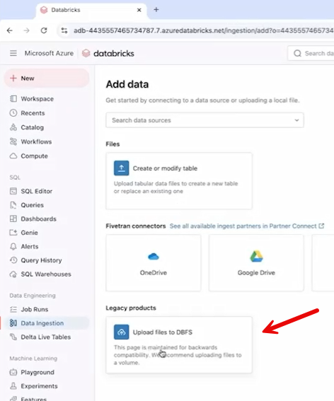 alt="Graphical user interface, application AI-generated content may be incorrect." />
>
> 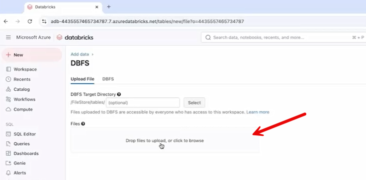 alt="Graphical user interface, text, application, email AI-generated content may be incorrect." />

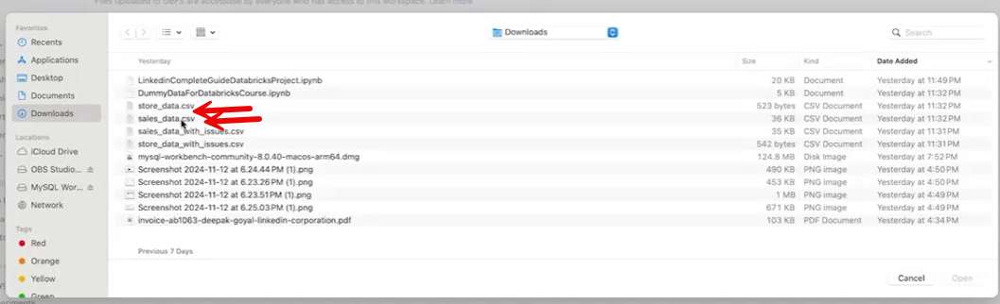

> 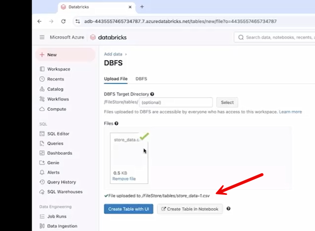 alt="Graphical user interface, text, application, email AI-generated content may be incorrect." />

- Loaded into Spark DataFrames using:

spark.read.csv(..., header=True, inferSchema=True)

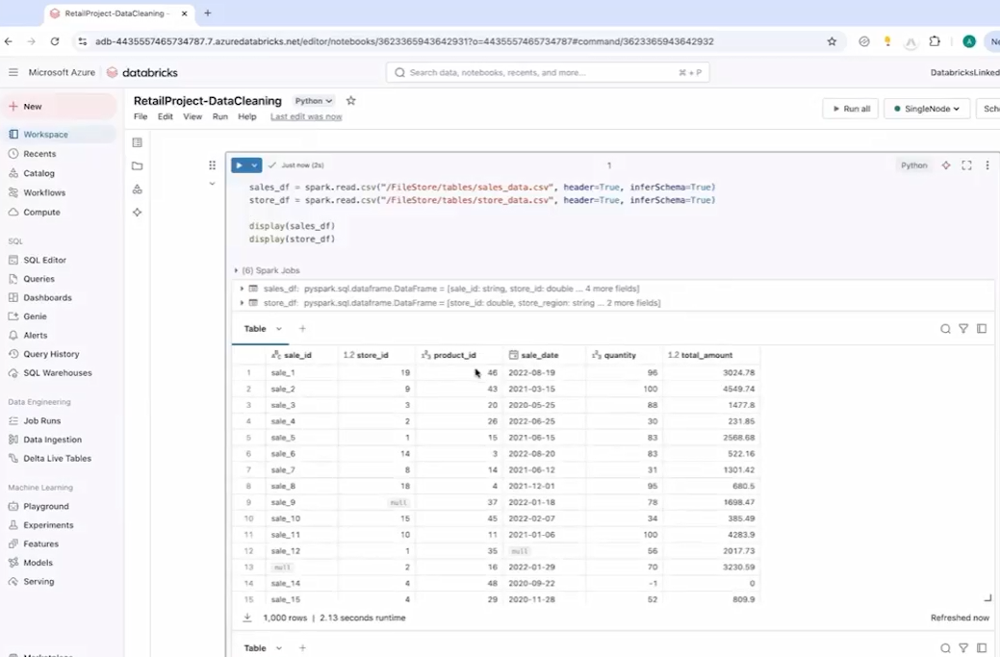

------------------------------------------------------------------------

**🧹 2. Data Cleaning**

**Sales Data (sales_df)**

- Filled nulls in:

  - quantity, total_amount → replaced with 0

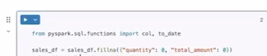

- Removed:

  - Duplicates (dropDuplicates)

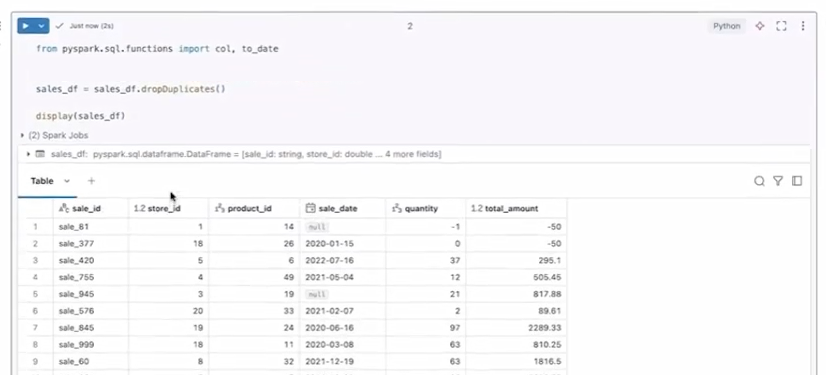

- Rows with nulls in sale_id, store_id, sale_date

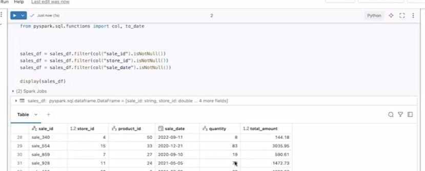

- Rows with negative quantity or total_amount

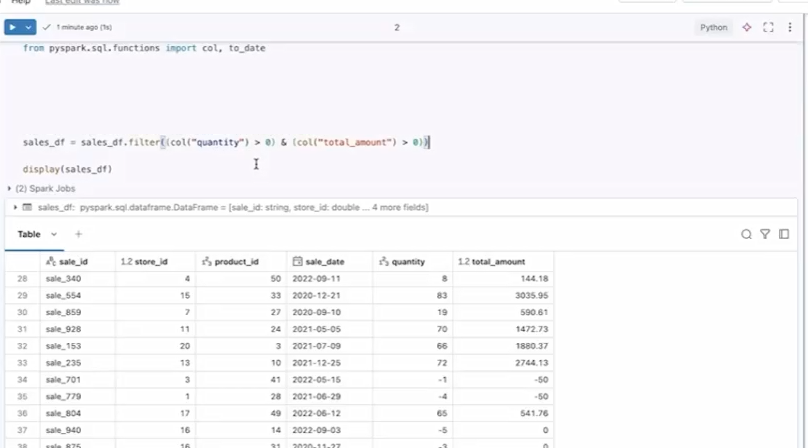

**Store Data (store_df)**

- Removed rows with null store_id and open_date

- Replaced null store_size with **average store size**

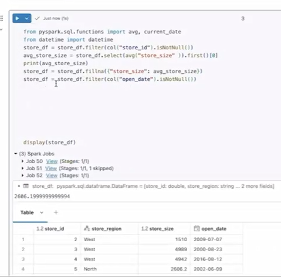

------------------------------------------------------------------------

**🔄 3. Data Transformation**

- Joined datasets on store_id (inner join) → combined_df

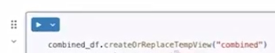

- Added new columns:

  - **Year** from sale_date

  - **Sales per sqft** = total_amount / store_size (rounded)

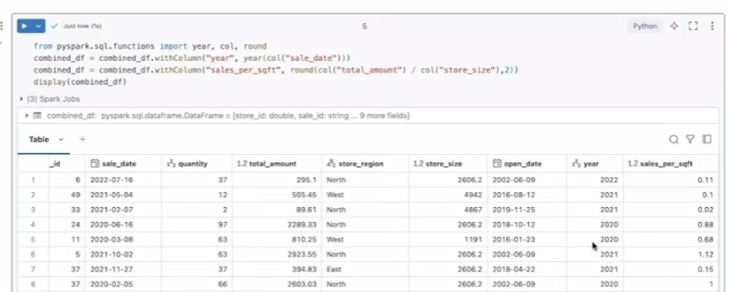

------------------------------------------------------------------------

**📊 4. Analysis**

- **Sales by Store & Region**

  - Aggregated total sales and quantity using Spark SQL

>  alt="Graphical user interface, text, application AI-generated content may be incorrect." />

- **Top 5 Products**

  - Based on total quantity sold (group + order + limit)

> 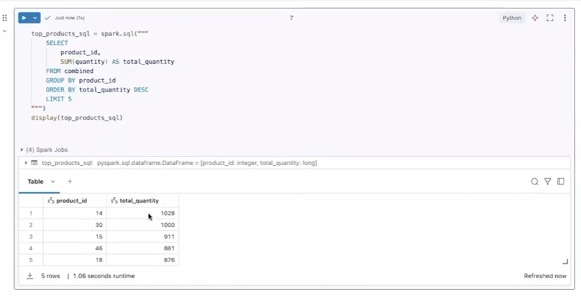 alt="Graphical user interface, text, application, email AI-generated content may be incorrect." />

- **Top 5 Stores**

  - Based on total sales (sorted + limited)

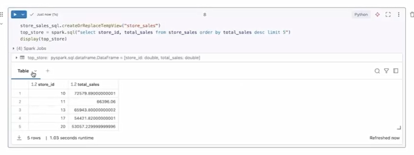

------------------------------------------------------------------------

**💾 5. Output**

- Saved results as **Parquet files** in DBFS:

  - top_products

  - top_store

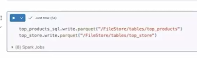

------------------------------------------------------------------------

**✅ End Result**

- Cleaned datasets

- Enriched data with new metrics

- Generated business insights (top stores/products)

- Stored outputs for downstream use

# [Content](./../content.md)