# What is Databricks

- **Databricks** is a cloud-based unified data analytics platform.

- Designed to simplify and accelerate:

  - Data engineering

  - Data science

  - Machine learning

  - Analytics workflows

- Built on **Apache Spark**.

- Fully managed service available on:

  - AWS

  - Azure

  - Google Cloud

------------------------------------------------------------------------

**In Simple Terms**

- Provides:

  - Spark clusters (compute power)

  - A UI to write and execute **PySpark** and other code

- Enables teams to process, analyze, and visualize large datasets
  efficiently.

------------------------------------------------------------------------

**Key Features**

- **Unified Platform**

  - Combines data engineering, data science, and machine learning in one
    platform.

  - No need for separate tools/accounts for different tasks.

- **Apache Spark Integration**

  - Built on top of Spark.

  - Optimized for distributed computing and large-scale data processing.

- **Collaborative Environment**

  - Shared notebooks.

  - Shared clusters.

  - Multiple team members can work simultaneously.

- **Scalability**

  - Auto-scaling clusters.

  - Scale from small (e.g., 2 nodes) to large (e.g., 200+ nodes) based
    on workload.

- **Seamless Cloud Integration**

  - Works with:

    - AWS (S3)

    - Azure Data Lake Storage (ADLS)

    - Google Cloud Storage

  - Can process data from multiple cloud environments.

- **Delta Lake**

  - Adds reliability and performance to data lakes.

  - Provides ACID transactions.

  - Default storage layer in Databricks.

- **Machine Learning Support**

  - Supports ML workflows within the same platform.

- **Security & Governance**

  - **Unity Catalog**:

    - Role-based access control

    - Data governance

    - Compliance with industry standards

------------------------------------------------------------------------

**Core Components**

- **Workspace**

  - Collaborative development environment.

  - Contains:

    - Notebooks

    - Libraries

    - Dashboards

- **Clusters**

  - Provide computational power.

  - Highly scalable.

  - Can be manually scaled or auto-scaled.

- **Databricks Notebooks**

  - Interactive coding environment.

  - Supports multiple languages.

- **Jobs**

  - Automate and schedule tasks:

    - ETL pipelines

    - ML workflows

    - Data processing jobs

- **Databricks Runtime**

  - Optimized version of Apache Spark.

  - Enhanced with additional performance improvements and features.

------------------------------------------------------------------------

**Use Cases**

- Data engineering workloads

- Building ETL pipelines

- Data ingestion and transformation

- Data science projects

- Running SQL queries on:

  - Structured data

  - Semi-structured data

  - Unstructured data

- Dashboarding and analytics

- End-to-end Lakehouse architecture

- Real-time analytics and stream processing

------------------------------------------------------------------------

**Limitations**

- **Cost**

  - Can be expensive.

  - Requires proper usage monitoring.

- **Learning Curve**

  - Takes time for new users to master.

- **Cloud Dependency**

  - Dependent on AWS, Azure, or GCP.

- **Limited Offline Access**

  - Primarily cloud-based platform.

------------------------------------------------------------------------

**Overall Conclusion**

- Databricks is a versatile, scalable platform for managing modern data
  workflows.

- Suitable for big data solutions across industries.

- Widely adopted for building Lakehouse and analytics solutions.

# Setting up a Databricks workspace

**Creating a Databricks Workspace**

- First step for practicing Databricks: **Create a Databricks
  workspace**.

- If you already have a workspace/account, you can skip this setup
  process.

------------------------------------------------------------------------

**Prerequisites**

- You need **at least one cloud account**:

  - Azure

  - AWS

  - Google Cloud (GCP)

- If you do **not** have a cloud account:

  - Use **Databricks Community Edition** (free option).

------------------------------------------------------------------------

**Option 1: Create Databricks with a Cloud Provider**

**Steps:**

- Search for **“Databricks account”** online.

- Click **“Get started with Databricks.”**

  - **https://www.databricks.com/try-databricks**

- Fill in:

> 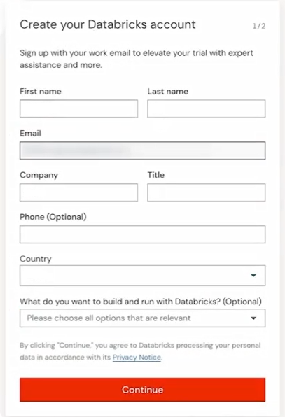 style="width:2.82639in;height:4.13889in" />

- Personal details

- Company name

- Job title

<!-- -->

- Click **Continue**.

- Choose your cloud provider:

> 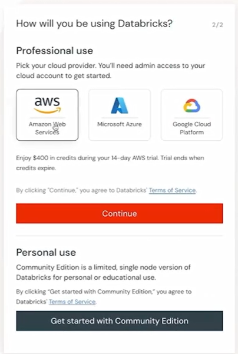 alt="Graphical user interface, application AI-generated content may be incorrect." />

- AWS

- Azure

- GCP

<!-- -->

- You get a **14-day free trial** with cloud providers.

- Free Community Edition

  - Full Details:
    https://www.databricks.com/product/faq/community-edition

------------------------------------------------------------------------

**Example: Creating Azure Databricks Workspace**

- Select **Azure** as cloud provider.

- Click **Continue with Azure Databricks**.

> 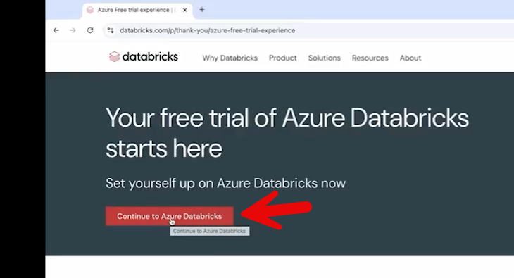 alt="Graphical user interface, text, email, website AI-generated content may be incorrect." />

- Log in to your Azure account.

- Create a new **Azure Databricks Workspace**:

  - Choose or create a **Resource Group**

  - Provide a workspace name

  - Select a region (e.g., West US)

  - Choose pricing tier (e.g., Premium)

- Click **Review + Create**

> 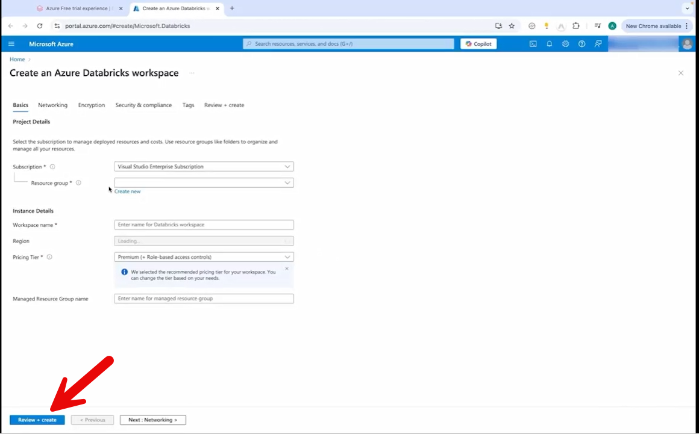 alt="Graphical user interface, text, application, email AI-generated content may be incorrect." />

- After validation, click **Create**

- Once deployment completes:

  - Click **Go to Resource**

> 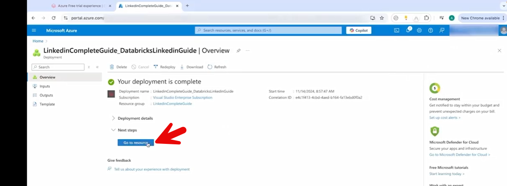 alt="Graphical user interface, text, application, email AI-generated content may be incorrect." />

- Launch the **Databricks Workspace**

> 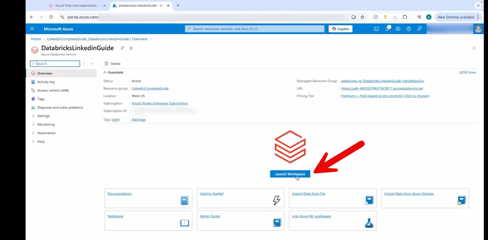 alt="Graphical user interface, text, application, email AI-generated content may be incorrect." />

------------------------------------------------------------------------

**Option 2: Use Databricks Community Edition (Free)**

- Click **“Get started with Community Edition.”**

- No cloud account required.

- Free to use.

**Limitations of Community Edition:**

- Some features are restricted (e.g., job scheduling).

- Most core learning features are still available.

------------------------------------------------------------------------

**Result**

- After setup, you reach the **Databricks Workspace welcome screen**.

- Workspace is ready for:

  - Creating notebooks

  - Running Spark jobs

  - Performing data engineering and analytics tasks.

# Navigating the Databricks interface

**Databricks Workspace Walkthrough**

- Databricks workspace contains multiple features and functionalities.

- The home screen is called the **Welcome Screen**.

- The left-hand panel contains the main navigation tabs.

------------------------------------------------------------------------

**New Button**

- Used to create new items such as:

> 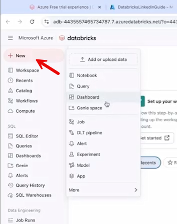 alt="Graphical user interface, application AI-generated content may be incorrect." />

- Notebooks

- Queries

- Dashboards

- Jobs

- Pipelines

<!-- -->

- Central place to start any new development task.

------------------------------------------------------------------------

**Add or Upload Data**

- Option to upload sample or test data.

- Useful for practice and experimentation.

------------------------------------------------------------------------

**Workspace Tab**

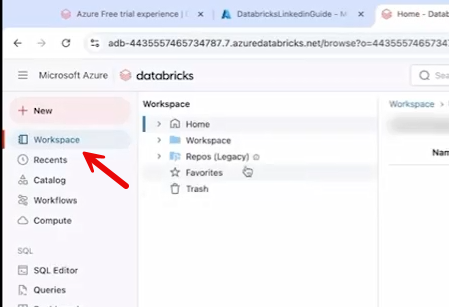

- Displays folder hierarchy.

- Shows:

  - Notebooks

  - Files

  - Project folders

- Initially empty in a new workspace.

- Helps organize and manage projects.

------------------------------------------------------------------------

**Recent Tab**

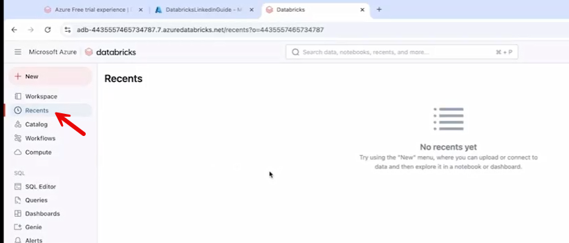

- Shows recently opened items:

  - Notebooks

  - Dashboards

  - Pipelines

  - Queries

------------------------------------------------------------------------

**Catalog Tab**

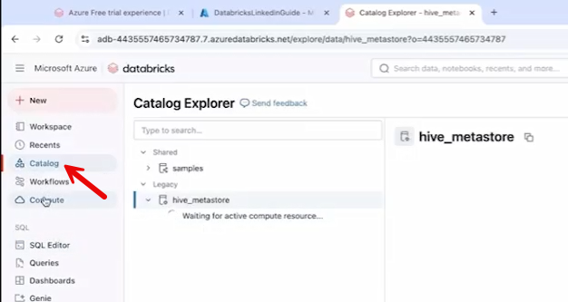

- Displays created tables.

- Primarily shows **Delta Tables**.

- Used to manage and explore data assets.

------------------------------------------------------------------------

**Compute Tab**

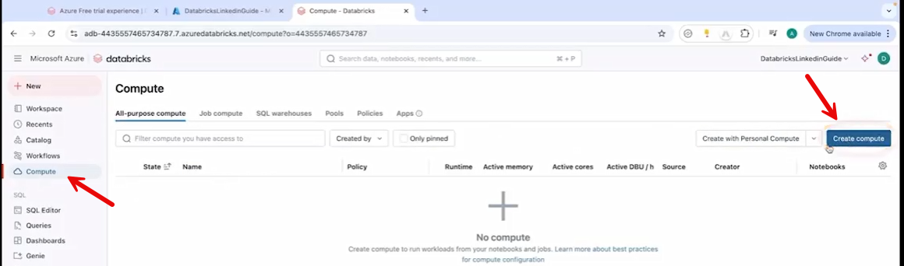

- Used to create and manage **clusters**.

- Required to run:

  - Notebooks

  - Jobs

  - Queries

- Essential for providing compute power.

------------------------------------------------------------------------

**SQL Tab**

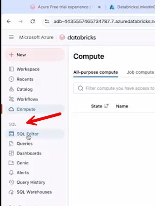

- Used for SQL-related tasks:

  - SQL Editor

  - Running queries

  - Creating dashboards

------------------------------------------------------------------------

**Data Engineering Section**

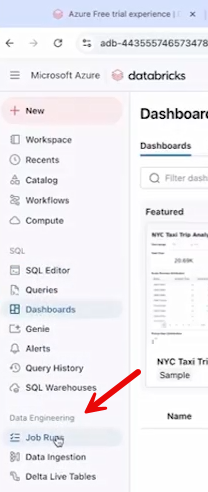

- Used to:

  - View job runs

  - Monitor job status

  - Check job history

------------------------------------------------------------------------

**Machine Learning Section**

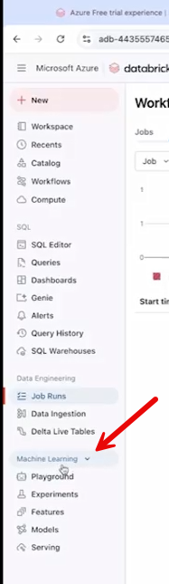

- Dedicated area for ML workflows.

- Includes:

  - Playground

  - Experiments

- Used for tracking and managing ML tasks.

------------------------------------------------------------------------

**Settings (Top Right Corner)**

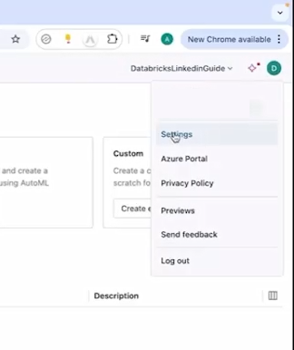

- Customize user preferences.

- Change appearance (e.g., Dark Mode).

- Manage:

> 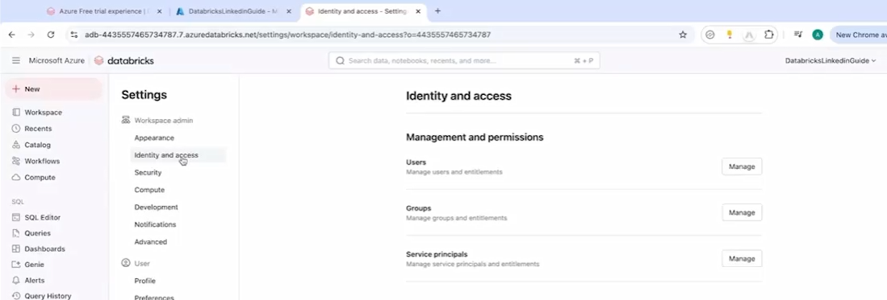 alt="Graphical user interface, text, application, email AI-generated content may be incorrect." />

- Users

- Groups

- Identity & Access Management (IAM)

------------------------------------------------------------------------

**Workspace Switcher**

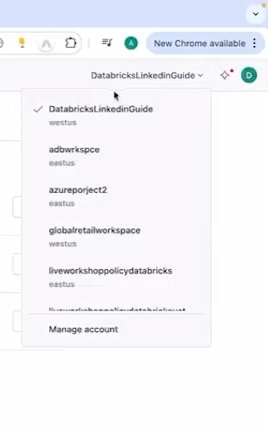

- Located at top-right.

- Allows switching between multiple workspaces:

  - Dev

  - UAT

  - Production

- No need to log out to switch environments.

------------------------------------------------------------------------

**Overall**

- Databricks UI is structured for:

  - Development

  - Data management

  - Compute management

  - SQL and ML workflows

- Familiarity increases as you continue using the platform.

# 1.4 Introduction to Databricks notebooks

**Databricks Notebooks**

- **Databricks Notebooks** are used to write and execute code in
  Databricks.

- Main place to implement data engineering, SQL, and ML logic.

------------------------------------------------------------------------

**Creating a Notebook**

- Click **+ New** → Select **Notebook**.

> 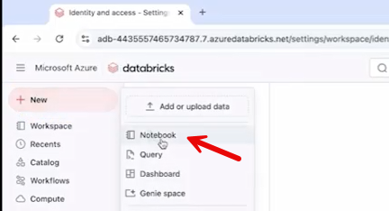 alt="Graphical user interface, application AI-generated content may be incorrect." />

- Rename the notebook by clicking on its default name (e.g.,
  FirstExample).

> 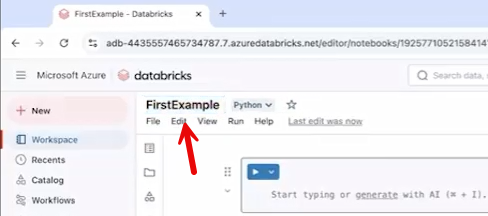 alt="Graphical user interface, text, application AI-generated content may be incorrect." />

------------------------------------------------------------------------

**Supported Languages**

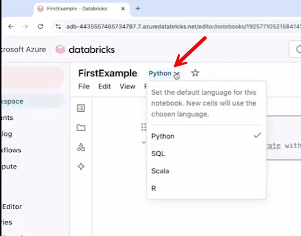

- Default language: **Python**

- Other supported languages:

  - SQL

  - Scala

  - R

- Language can be selected during notebook creation.

- Course uses **Python**.

------------------------------------------------------------------------

**Auto-Save & Version Control**

- Notebooks are **auto-saved** (no manual save required).

- **Version History** (right-hand side):

> 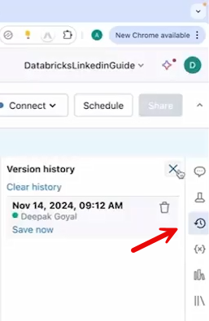 alt="Graphical user interface, text, application AI-generated content may be incorrect." />

- Track changes

- See who made changes

- Compare versions

- Roll back if needed

------------------------------------------------------------------------

**Cells in Notebooks**

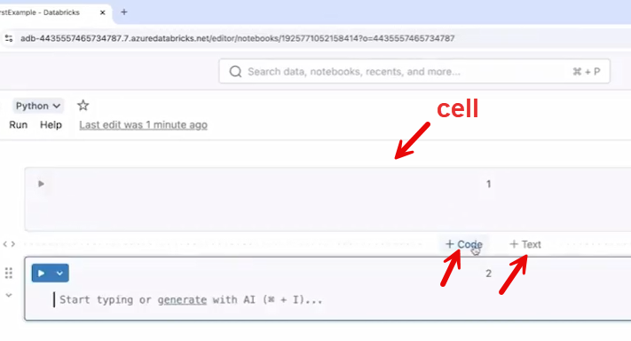

- Code is written inside **cells**.

- Options:

  - Write entire code in one cell

  - Create multiple cells using **+ Code**

**Best Practice:**

- Use multiple cells.

- Keep each cell limited to ~10–15 lines.

- Improves readability and maintainability.

------------------------------------------------------------------------

**Markdown (Text) Cells**

- **Select Text**

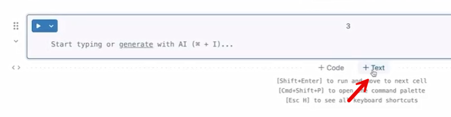

- **Write your markdown**

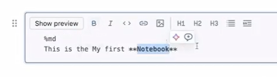

- **Run cell by click outside the cell**

- Can create **text/markdown cells**.

- Used for:

  - Titles

  - Explanations

  - Documentation

- Not executed as code.

- Supports formatting (e.g., bold text).

------------------------------------------------------------------------

**Running Code**

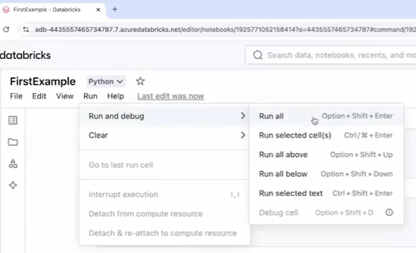

- Run options:

  - Run entire notebook

  - Run selected cells

  - Run a single cell

- Use the **Run** button at the top.

------------------------------------------------------------------------

**Clearing Output**

- Option to **Clear All Cell Outputs**.

> 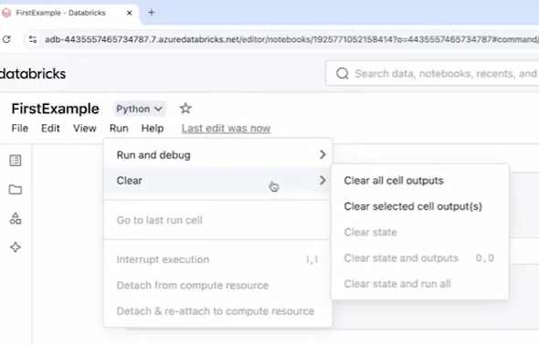 style="width:3.73446in;height:2.39259in" />

- Removes execution results without deleting code.

------------------------------------------------------------------------

**View & Layout Options**

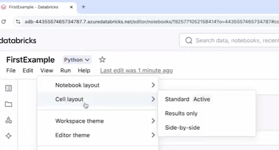

- Change notebook layout via **View** menu.

- Options include:

  - Horizontal layout

  - Side-by-side layout

- Customize appearance and structure.

------------------------------------------------------------------------

**Accessing Notebooks**

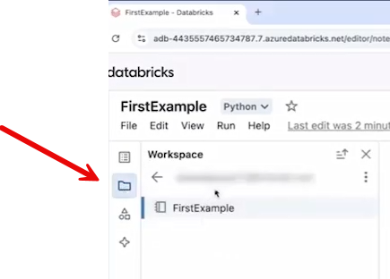

- Click **Workspace tab** to view:

  - All created notebooks

  - Folder structure

------------------------------------------------------------------------

**Next Step**

- After creating a notebook, the next requirement is to:

  - Create a **Compute Cluster**

  - Attach it to the notebook for execution.

# Create a single-node cluster for practice

**Compute Cluster in Databricks**

- Notebooks **cannot execute on their own**.

- They require **compute power**, which is provided by a **cluster**.

------------------------------------------------------------------------

**Creating a Compute Cluster**

- Go to **Compute** tab.

> 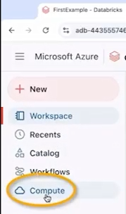 alt="Graphical user interface, application AI-generated content may be incorrect." />

- Click **Create Compute**.

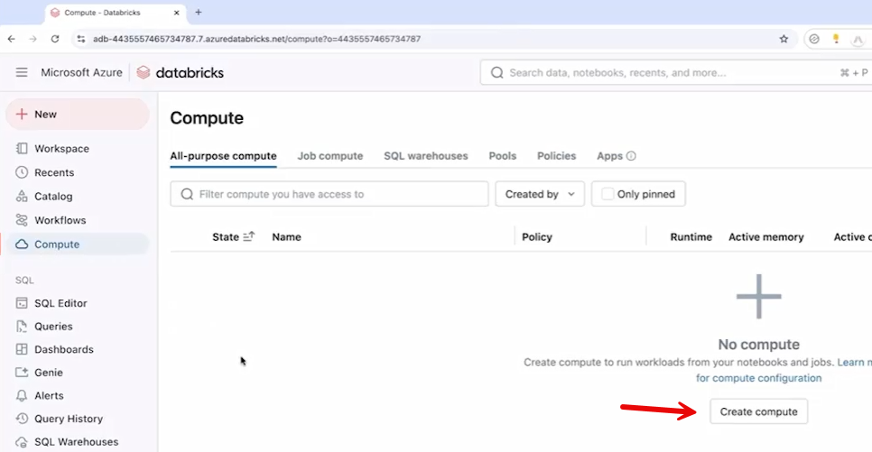

------------------------------------------------------------------------

**Types of Clusters**

- **Multi-Node Cluster**

  - Multiple machines work together.

  - Suitable for large-scale data processing.

  - Higher cost.

- **Single-Node Cluster**

  - Runs on one machine.

  - Suitable for learning and small workloads.

  - Lower cost (recommended for practice).

------------------------------------------------------------------------

**Configuring the Cluster**

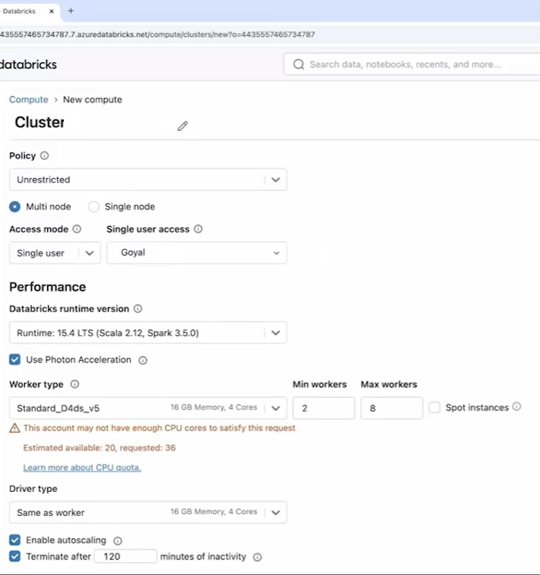

- Select **Single Node**.

- Rename cluster (e.g., SingleNode cluster).

- Optional settings:

  - Choose node type.

  - Disable **Photon Acceleration** (reduces cost).

  - Set **Auto Termination** (e.g., 60 minutes).

    - Automatically shuts down if idle.

- Click **Create Compute**.

- Wait for cluster to start.

------------------------------------------------------------------------

**Cluster Status**

- Green indicator next to cluster name = **Cluster is running**.

- Cluster must be active before executing notebooks.

------------------------------------------------------------------------

**Attaching Cluster to Notebook**

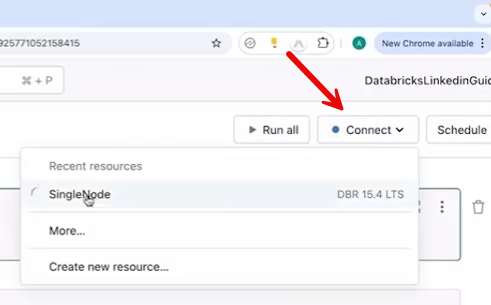

- Open the notebook.

- Click **Connect** (top right).

- Select the created cluster.

- Notebook is now attached and ready to execute once cluster starts.

------------------------------------------------------------------------

**Executing Code**

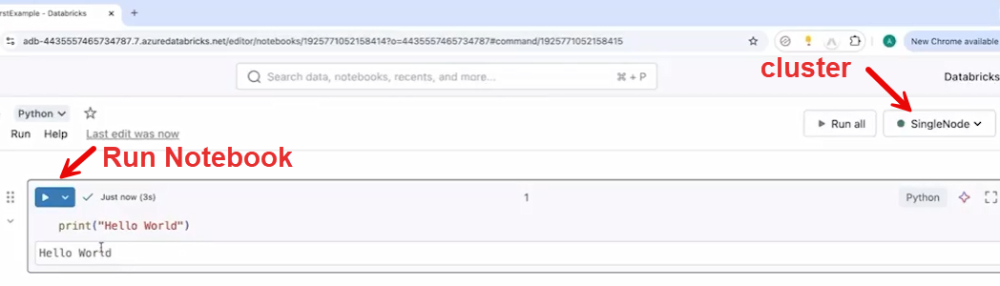

- After cluster turns green:

  - Write code (e.g., print("Hello world")).

  - Run the cell.

- Output is displayed below the cell.

------------------------------------------------------------------------

**Key Takeaways**

- Cluster provides execution power.

- Single-node cluster is best for learning.

- Always attach a running cluster to a notebook before execution.

- Auto-termination helps control cost.

------------------------------------------------------------------------

**Next Step**

- Learn how to:

  - Load data into Databricks

  - Use PySpark

  - Explore and analyze data.
