# 3.1 Understand DataFrames

**What is a DataFrame in Spark?**

- **DataFrame definition:** Distributed collection of data organized
  into rows and columns

- **Similarity to databases:** Works like tables in relational databases
  (PostgreSQL, MySQL, SQL Server)

- **Purpose:** Core abstraction for handling structured and
  semi-structured data

- **Support for various data sources:** Can be created from formats like
  CSV, JSON, Parquet, ORC, etc.

**Key features:**

- **Schema-defined:** Has fixed column names and data types

- **Distributed:** Data is spread across a cluster for parallel
  processing

- **Immutable:** Any transformation creates a new DataFrame (original
  remains unchanged)

- **Optimized:** Uses Spark’s Catalyst Optimizer for efficient query
  execution

- **Overall:** Provides a high-level API for processing large-scale data
  efficiently

# **3.**2 Read a CSV file in Databricks

- Using Notebooks with Linux
  commands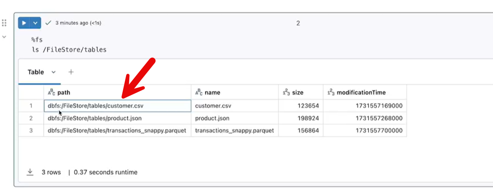

<!-- -->

- **Get file path:** Locate CSV in DBFS (Catalog → Browse DBFS) and copy
  its path

> 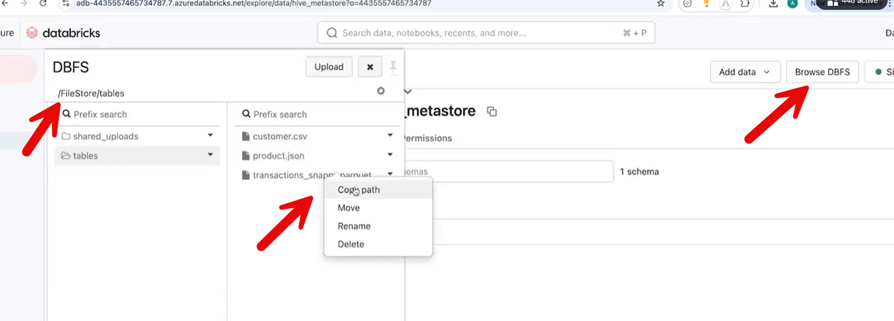 alt="Graphical user interface AI-generated content may be incorrect." />
>
> 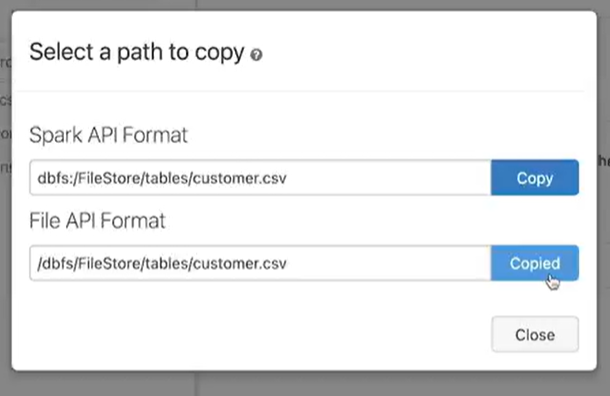 alt="Graphical user interface, application AI-generated content may be incorrect." />

- **Create notebook:** Use Databricks workspace to create a new notebook

- **Read CSV:** Use spark.read.csv(path) to load data into a DataFrame

- **View data:**

  - df.show() → displays first 20 rows

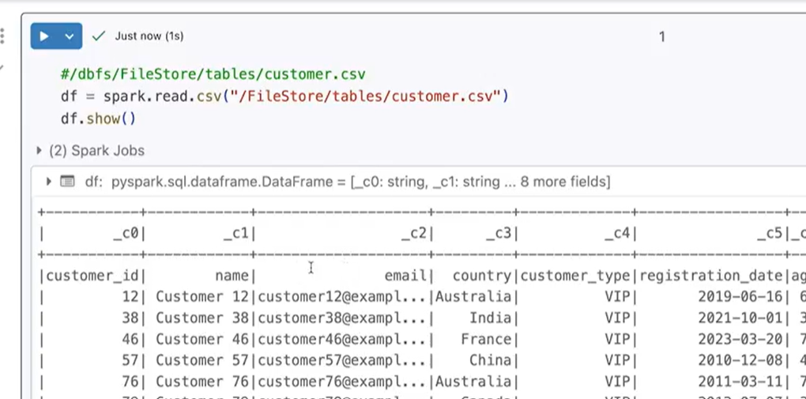

- display(df) → better UI in Databricks

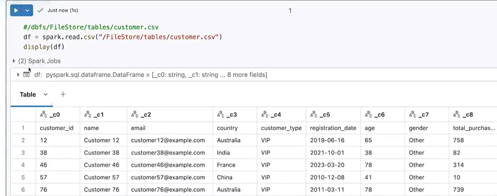

**Handling column names & schema:**

- **Header issue:** Default column names appear as \_c0, \_c1, ...

- **Fix headers:** Use header=True to treat first row as column names

> 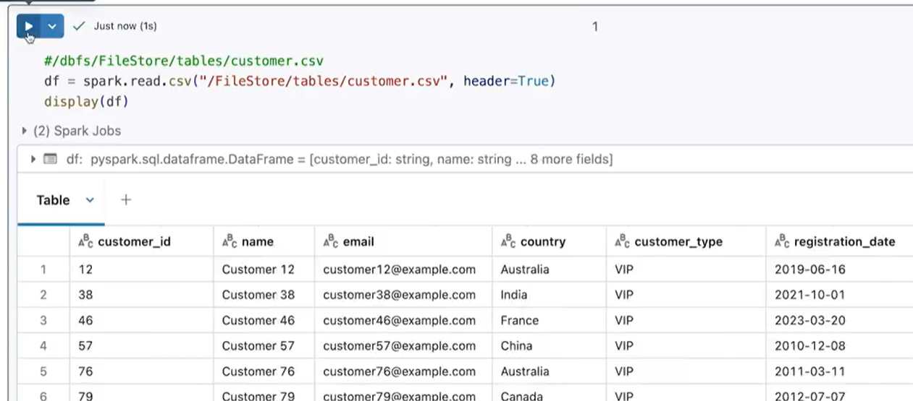 alt="Table AI-generated content may be incorrect." />

- **Check schema:** Use df.printSchema()

> 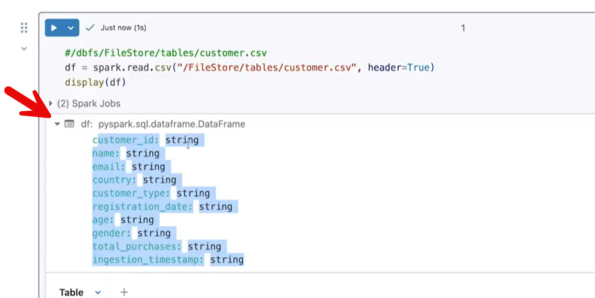 alt="Graphical user interface, text, application, email AI-generated content may be incorrect." />
>
> 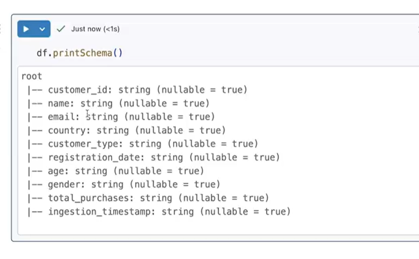 alt="Graphical user interface, text, application AI-generated content may be incorrect." />

**Data types:**

- By default, all columns are read as **strings**

- Use inferSchema=True to automatically detect correct data types

> 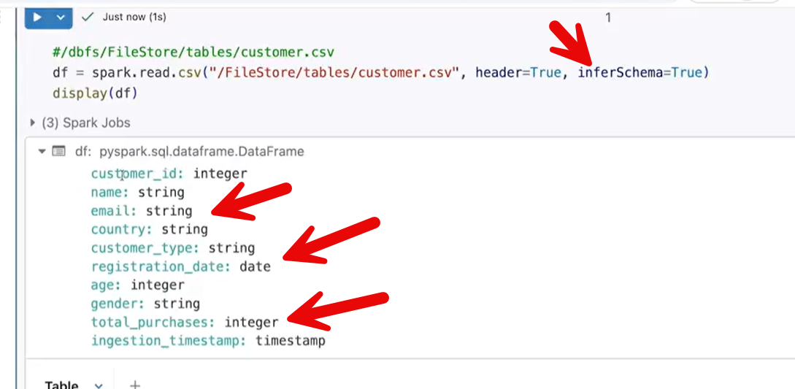 alt="Graphical user interface, text, application AI-generated content may be incorrect." />

**Other options:**

- Can specify custom delimiter using sep (e.g., pipe \| instead of
  comma)

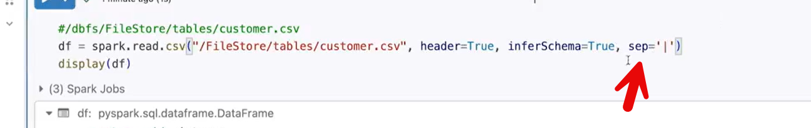

- **Summary:** Load CSV → set header=True for column names → use
  inferSchema=True for correct data types → view data with show() or
  display()

# 3.3 Read a CVS file in Databricks

**Custom schema definition:** Use pyspark.sql.types (e.g., StructType,
StructField, StringType, IntegerType) to define schema manually

**Structure:**

- Create schema using StructType(\[...\])

- Define each column with StructField(column_name, data_type, nullable)

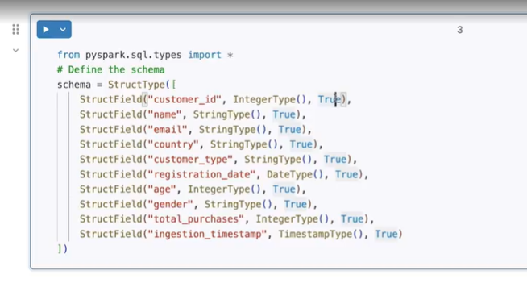

**Why use custom schema:**

- Gives full control over column data types

- Avoids reliance on automatic detection (inferSchema)

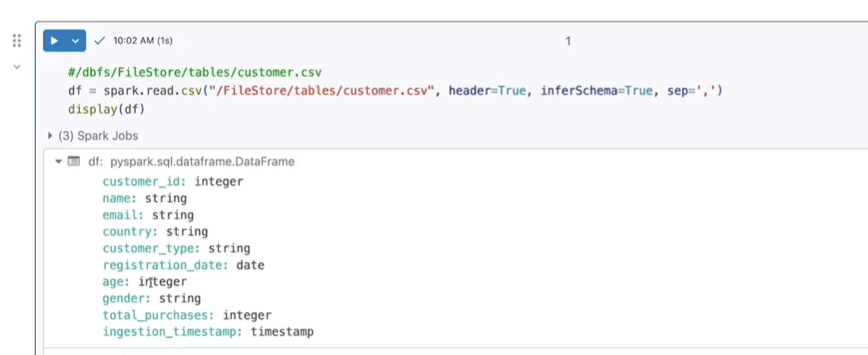

**Applying schema:**

- Use spark.read.csv(path, header=True, schema=schema) to load data with
  predefined schema

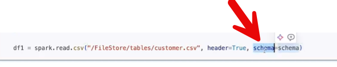

- Verify using df.printSchema()

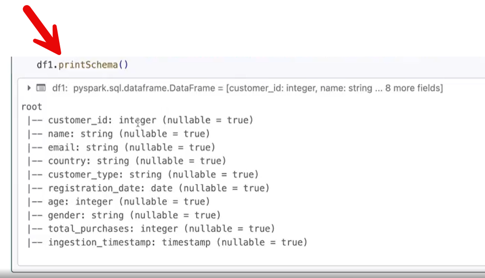

**Advantages over inferSchema:**

- More accurate and consistent data types

- Faster performance (no need to scan entire file to infer types)

**Key takeaway:** Defining your own schema improves control, accuracy,
and performance when reading data in Databricks

# 3.4 Read a JSON file in Databricks

**Create notebook:** Set up a new notebook (e.g., *Product Analysis*)

**Get file path:** Locate JSON file in DBFS (Catalog → Browse DBFS) and
copy path

**Read JSON file:**

- Use spark.read.json(path) to load data into a DataFrame

- Use display(df) to view data

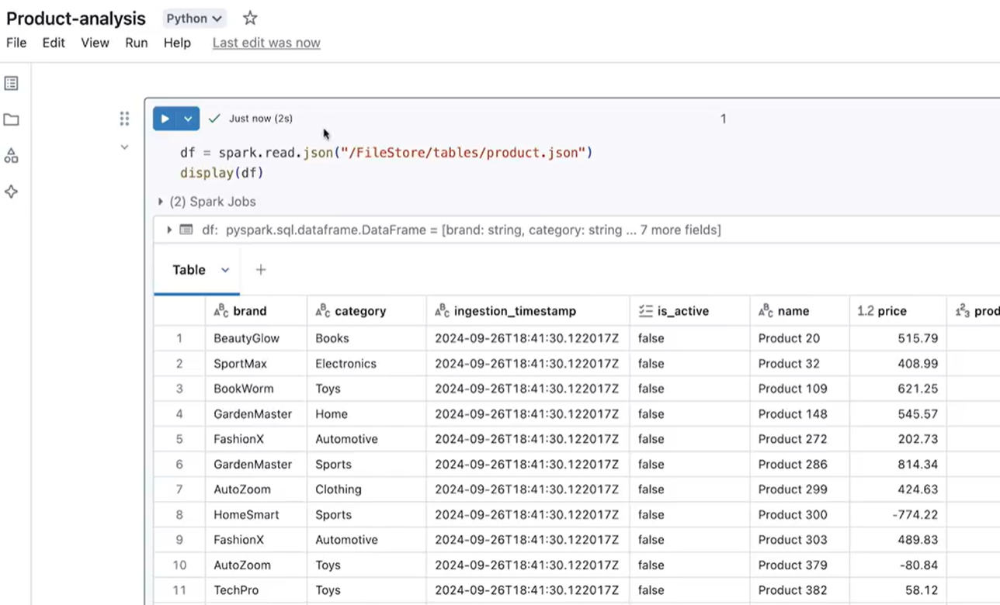

**Cluster behavior:** Databricks automatically attaches a cluster when
executing code

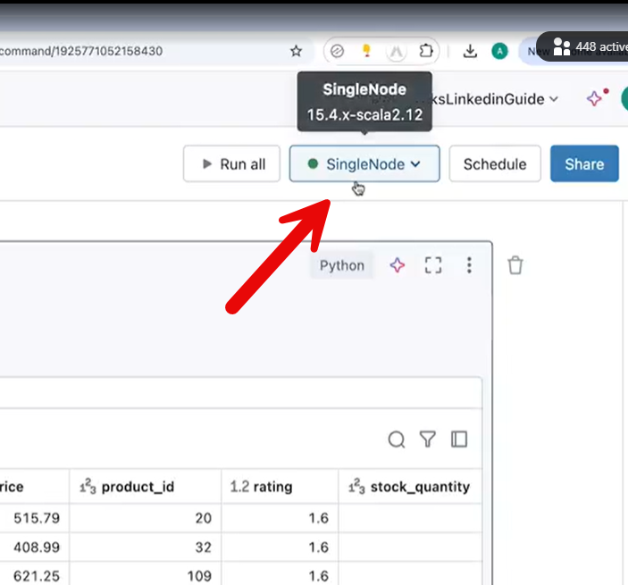

**Schema handling:**

- JSON files automatically infer correct data types (no need for
  inferSchema=True)

- Check schema using df.printSchema()

> 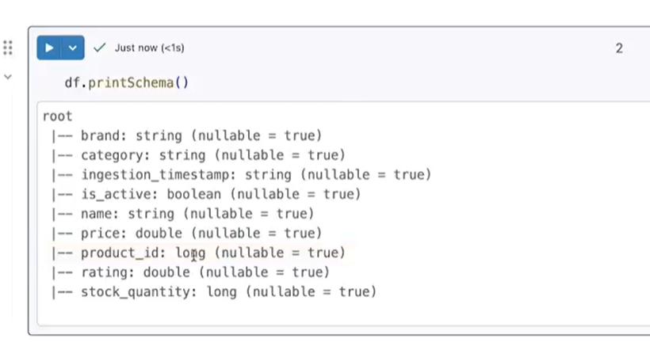 style="width:5.69474in;height:3.0696in" />

**Custom schema (optional):**

- Define schema using StructType and StructField

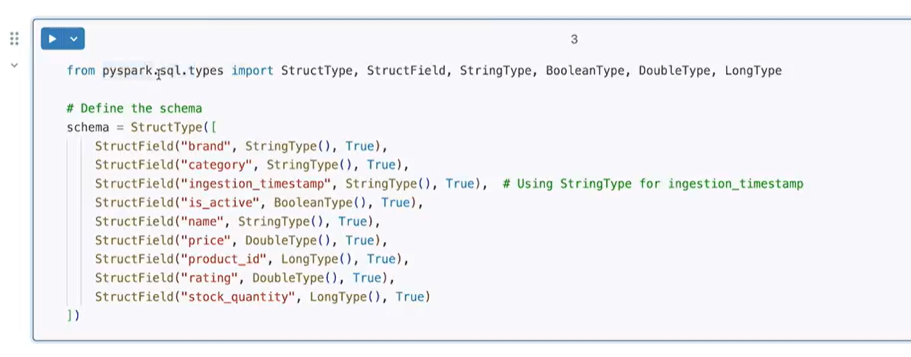

- Apply using spark.read.json(path, schema=schema)

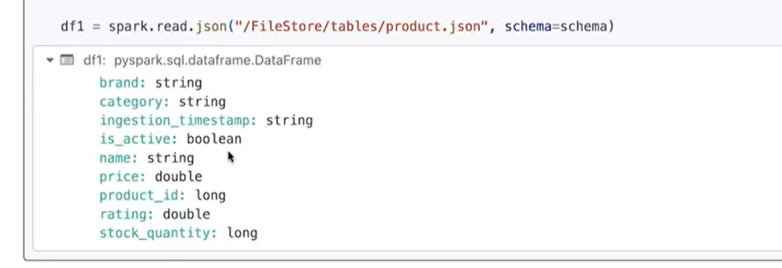

**Why define schema manually:**

- Full control over data types

- Overrides automatic inference if needed

**Key takeaway:** JSON files in Databricks are easy to read with
automatic schema detection, but custom schemas can still be applied for
control and consistency

# 3.5 Read a Parquets file in Databricks

**Create notebook:** Set up a new notebook (e.g., *Transaction
Analysis*)

**Get file path:** Copy parquet file path from DBFS (Catalog → Browse
DBFS)

**Read parquet file:**

- Use spark.read.parquet(path) to load data into a DataFrame

- Use display(df) to view results

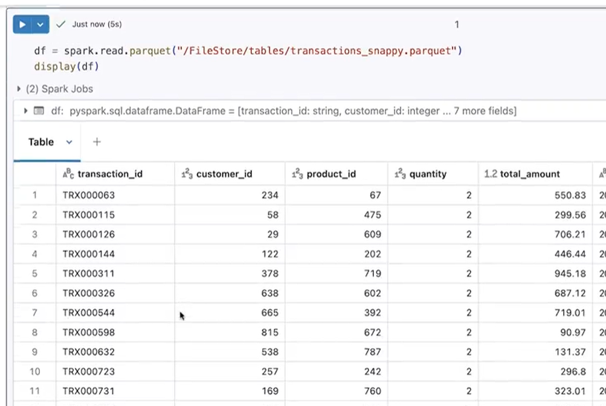

**Schema behavior:**

- Parquet automatically preserves and detects correct data types

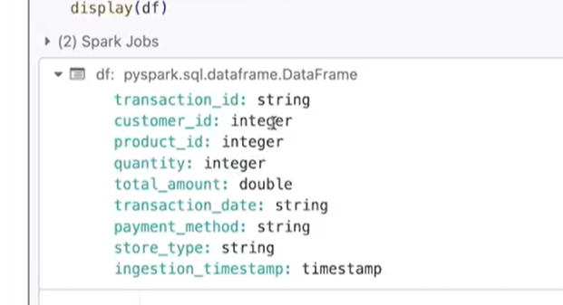

- Schema can be viewed by expanding DataFrame or using printSchema()

**Custom schema (optional):**

- Define schema using StructType and StructField

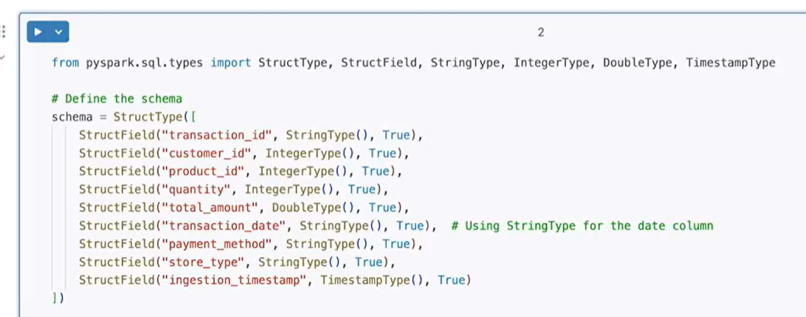

- Apply using spark.read.schema(schema).parquet(path)

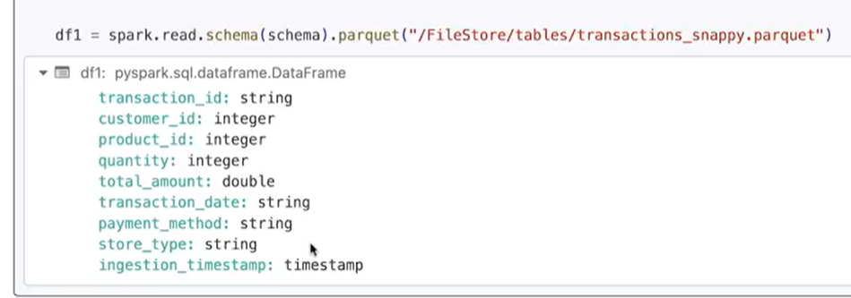

**Key takeaway:**

- Parquet is efficient and already schema-aware

- Manual schema definition is optional but allows full control over data
  types

# 3.6 Handle nested JSON data in Databricks

**Nested JSON concept:** JSON files can contain other JSON objects
(hierarchical structure)

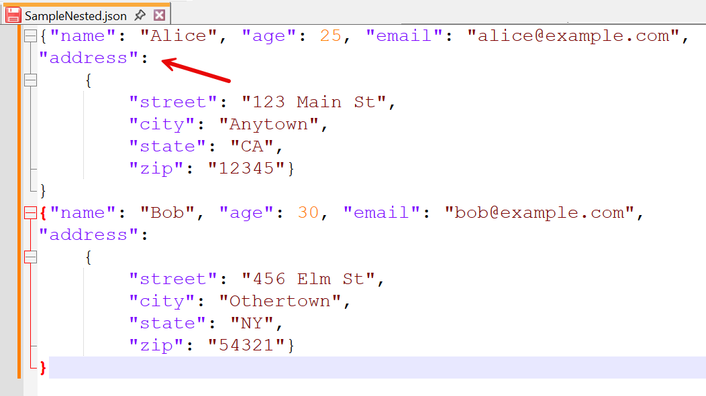

**Upload file:** Add nested JSON to DBFS using “Upload Data” option

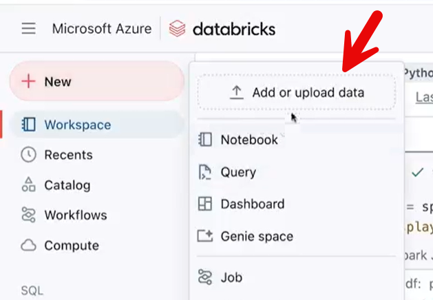

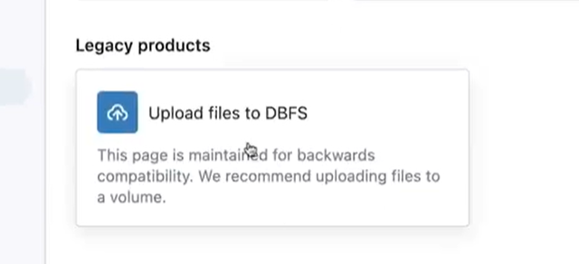

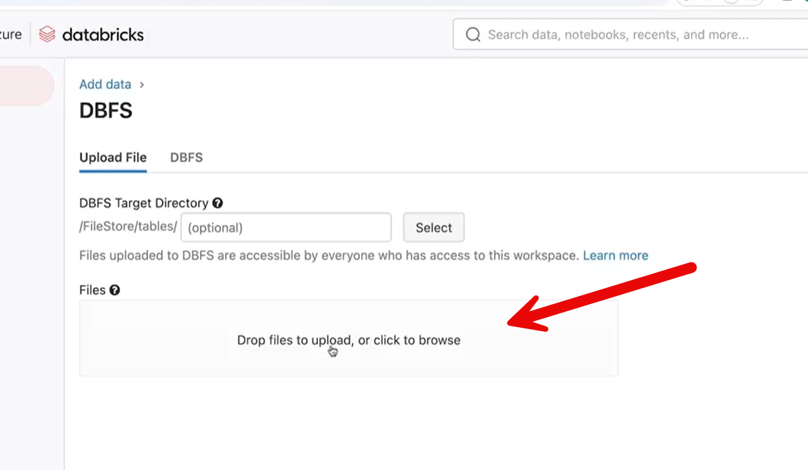

**Get file path:** Copy the uploaded file path for use in code

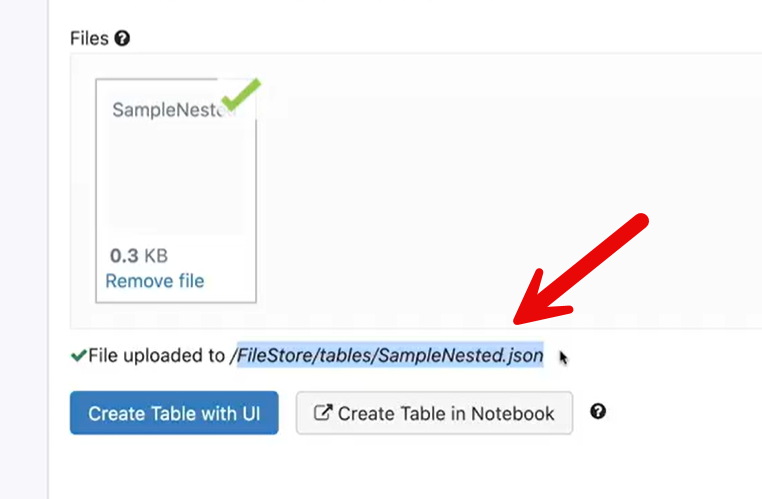

**Read nested JSON:**

- Use spark.read.json(path) just like a regular JSON file

- Display using display(df)

> 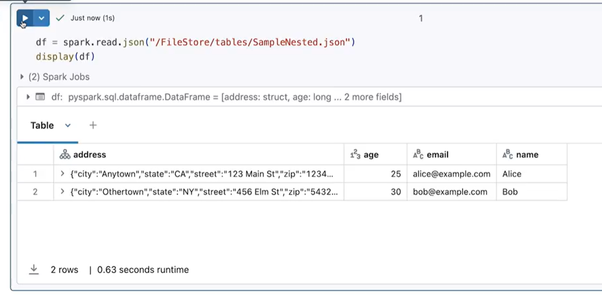 alt="Graphical user interface, table AI-generated content may be incorrect." />

**Output behavior:**

- Simple fields (e.g., name, age, email) appear normally

- Nested fields (e.g., address) appear as structured/JSON objects

**Access nested data:**

- Use dot notation (e.g., address.city, address.state) to access inner
  fields

**Key takeaway:**

- Nested JSON is read the same way as regular JSON, but requires
  additional handling (dot notation) to access nested fields

# [Context](./../context.md)