# 4. PySpark Transformation in Databricks

## 4.1 Use filter and where transformations in PySpark

- Reading data in Databricks is just the first step—**most effort goes
  into cleaning and analyzing data**.

- The **filter() function** is used to extract only relevant records
  from large datasets.

**Ways to apply filtering:**

- Using **column with brackets**: df\["column"\] == value

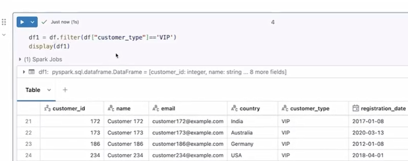

- Using **col() function** from pyspark.sql.functions

- Using **column() function**

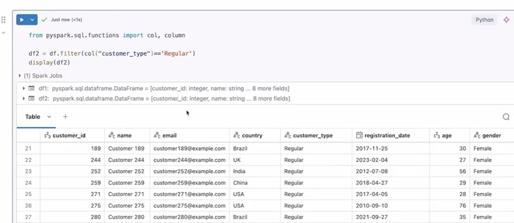

> 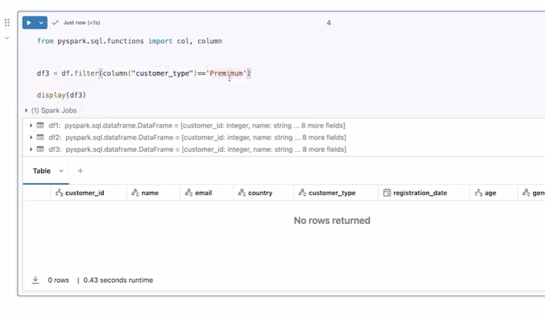 alt="Graphical user interface, text, application, email AI-generated content may be incorrect." />

- Using **dot notation**: df.column == value

> 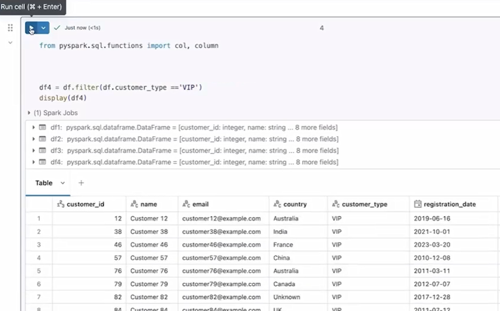 alt="Table AI-generated content may be incorrect." />

All methods achieve the same result—choose based on preference.

**Multiple conditions:**

- Use **AND (&)** to combine conditions  
  → e.g., VIP customers **and** from USA

  
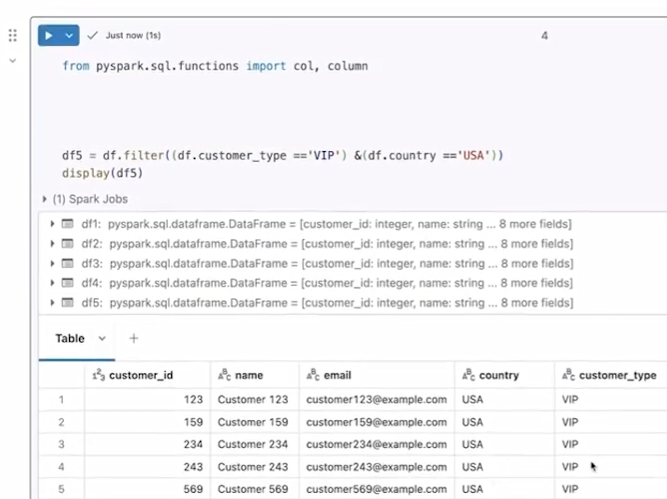

- Use **OR (\|)** for alternative conditions  
  → e.g., VIP customers **or** customers from USA

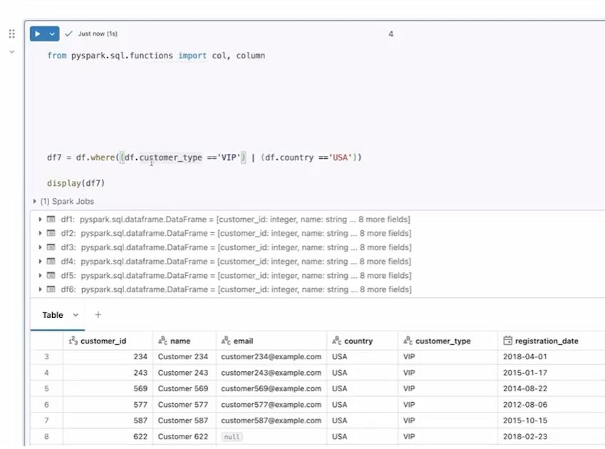

**where() function:**

- Works exactly the same as filter() and can be used interchangeably.

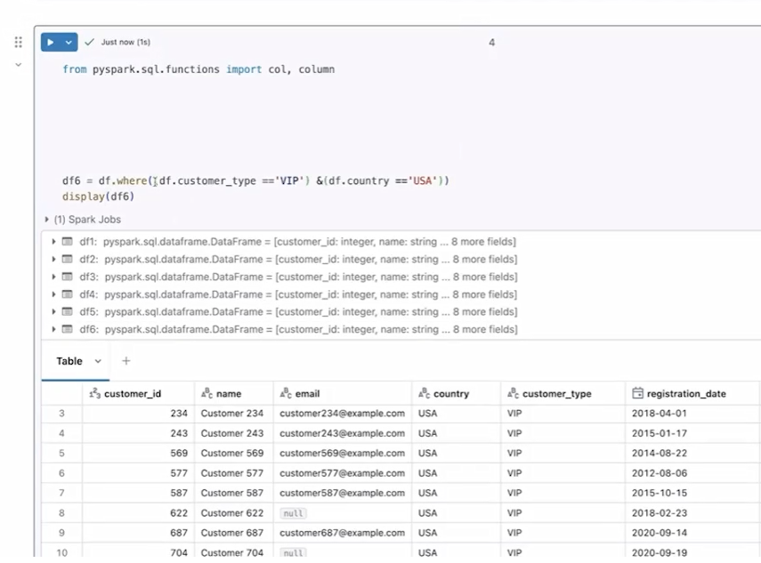

**Key idea:**  
Databricks provides flexible ways to filter data using different
syntaxes, with support for multiple conditions using logical operators.

## 4.2 Add or remove columns in PySpark

A lesson on **adding, renaming, and removing columns in PySpark**:

- **Adding columns:**

  - Use **withColumn()** to create a new column.

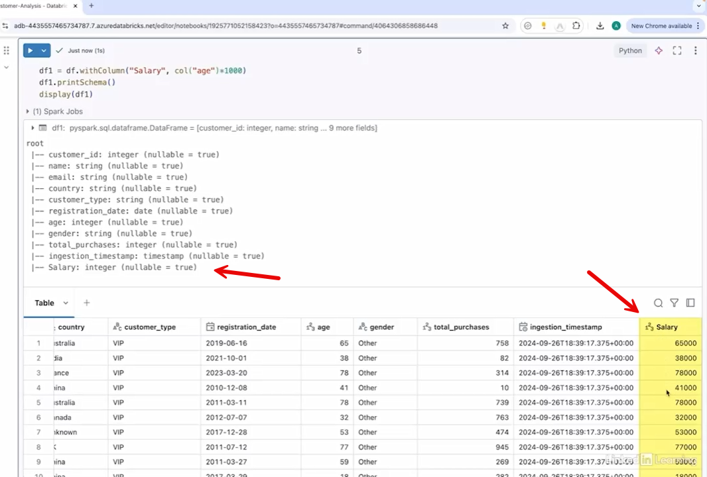

- The new DataFrame includes all existing columns plus the new one.

- Column values can be:

  - Derived from existing columns (e.g., salary = age × 1000)

  - Based on conditions using **when()**

    - Example: classify as *Senior* if age \> 30, else *Junior*

- Requires importing: from pyspark.sql.functions import when

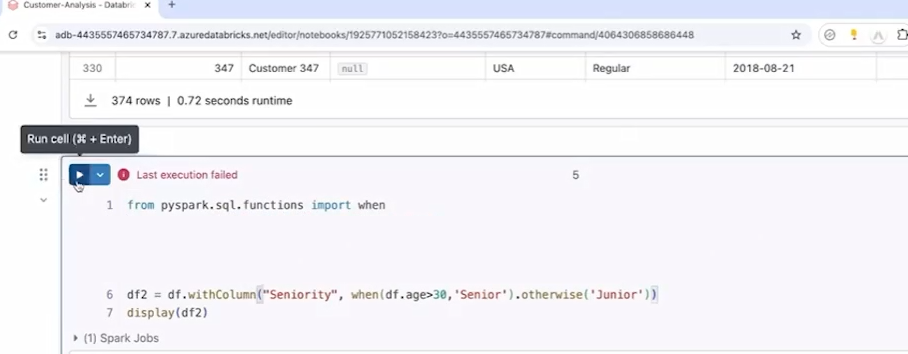

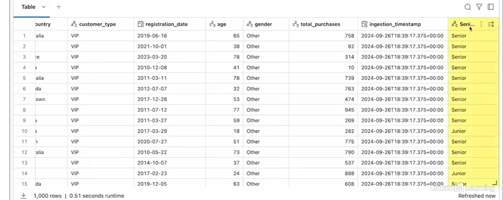

- **Renaming columns:**

  - Use **withColumnRenamed(old_name, new_name)**

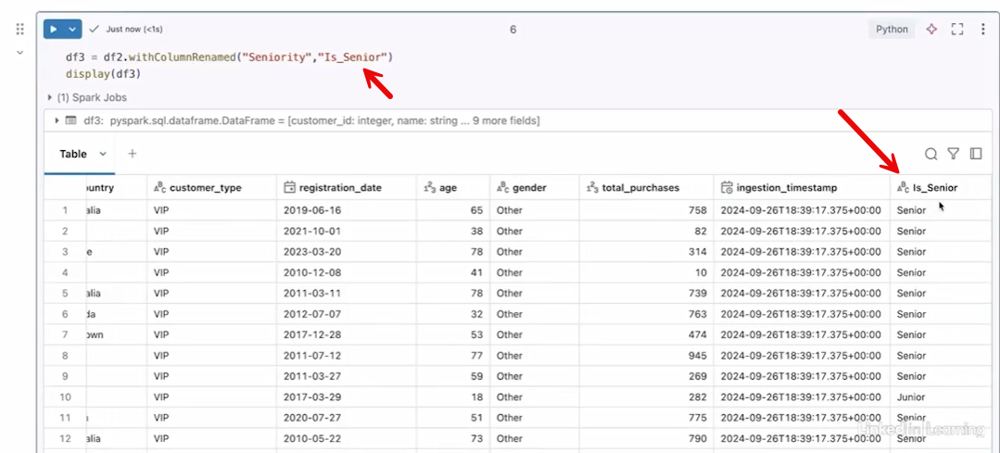

- Only the column name changes; data remains the same.

<!-- -->

- **Dropping columns:**

  - Use **drop()** to remove columns.

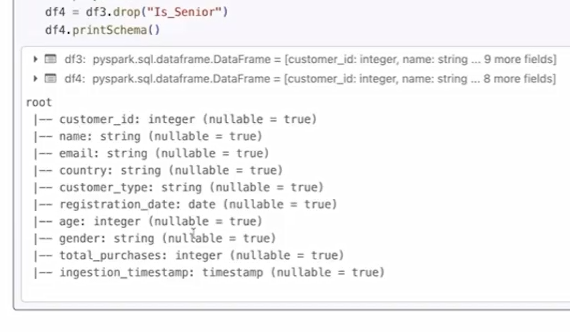

- Can remove:

  - A single column

  - Multiple columns (comma-separated)

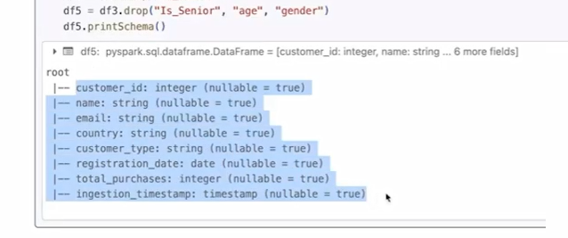

- **Important concept:**

  - Every transformation creates a **new DataFrame**—original data
    remains unchanged.

**Key idea:**  
PySpark provides simple functions (withColumn, withColumnRenamed, drop)
to modify DataFrame structure while preserving immutability.

## 4.3 Use the select function in PySpark

A lesson on **using the select() function in PySpark**:

- **Selecting specific columns:**

  - Use **select()** to retrieve only the columns you need (similar to
    SQL).

  - Example: selecting age, gender, customer_type instead of all
    columns.

  - Returns a **new DataFrame** with only selected columns.

> 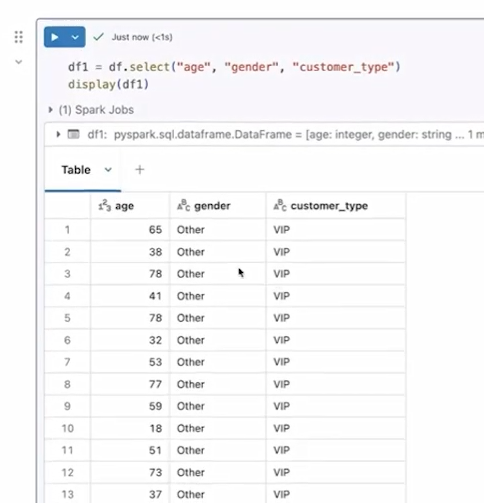 alt="Table AI-generated content may be incorrect." />

- **Creating derived columns:**

  - You can perform operations inside select().

  - Example: age \* 1000 to create a salary-like column.

  - Use **.alias()** to rename derived columns for readability.

> 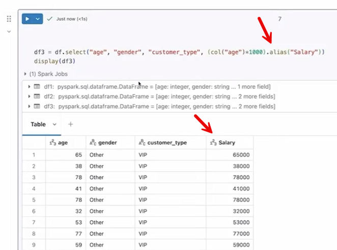 alt="Table AI-generated content may be incorrect." />

- **Working with nested JSON:**

> 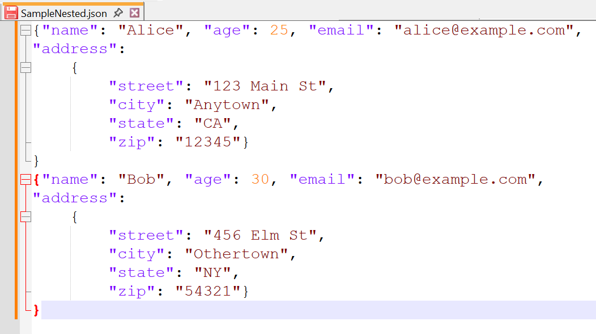 alt="Text AI-generated content may be incorrect." />

- Use **dot notation** to access nested fields.

- Example: address.city, address.state

- Combine with other columns like age, name, email.

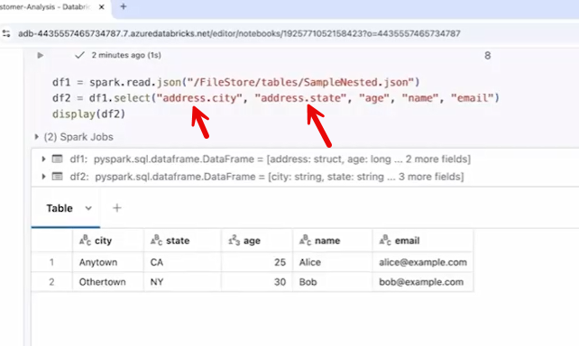

- **Key idea:**

  - select() allows flexible data extraction, transformation, and
    handling of nested structures in PySpark.

**Overall:**  
select() is essential for choosing relevant data, creating computed
columns, and working with structured or nested data efficiently.

## 4.4 Use UNION and DISTINCT in PySpark

A lesson on **UNION and DISTINCT in PySpark**:

- **Union of DataFrames:**

  - Use **union()** to combine rows from two or more DataFrames.

  - Example: combining VIP and Regular customer DataFrames.

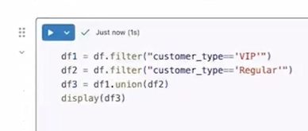

- You can chain multiple unions: df1.union(df2).union(df3)

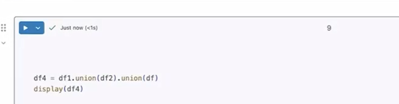

- Result includes **all rows**, including duplicates.

<!-- -->

- **Removing duplicates:**

  - Use **distinct()** to keep only **unique rows** across all columns.

  - Helps reduce duplicate records after union operations.

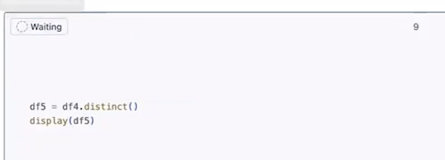

- **Distinct on specific columns:**

  - Use **select(column).distinct()** to get unique values of a single
    column.

  - Can also use multiple columns:

    - select(col1, col2).distinct() → unique combinations of those
      columns

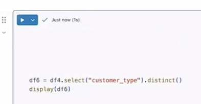

- **Key idea:**

  - union() merges datasets, while distinct() ensures uniqueness—either
    across all columns or selected ones.

**Overall:**  
These functions are essential for combining datasets and cleaning
duplicates in PySpark workflows.

## 4.5 Handle nulls in PySpark

A lesson on **handling nulls in PySpark**:

- **Dropping null values:**

  - Use **df.na.drop()** or **df.dropna()**

  - Removes rows where **any column contains null values**

> 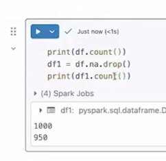 alt="Graphical user interface, text, application AI-generated content may be incorrect." />

- **Identifying nulls:**

  - Use **isNull()** or **isNotNull()** with filter()

  - Example: find rows where email is null

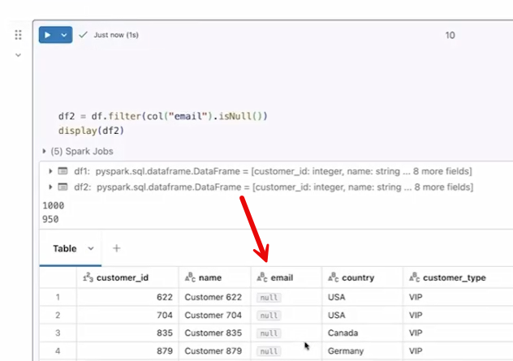

- **Filling null values:**

  - Use **df.na.fill(value)** or **df.fillna(value)**

  - Replace all nulls with a single value (e.g., "unknown")

- **Column-specific filling:**

  - Use a **dictionary** to assign different values per column

  - Example: { "email": "unknown", "age": 0 }

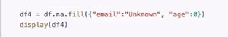

- **Key idea:**

  - Nulls can be handled by either **removing rows** or **replacing
    missing values**, depending on the use case.

**Overall:**  
PySpark provides flexible methods (drop, fill, isNull) to efficiently
detect and handle missing data in datasets.

4.6 Use sortBy and orderBy in PySpark

A lesson on **orderBy and sort in PySpark**:

- **Sorting data:**

  - Use **orderBy()** or **sort()** to arrange DataFrame rows.

  - By default, sorting is in **ascending order**.

- **Single and multiple columns:**

  - Sort by one column: df.orderBy("age")

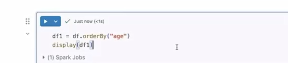

- Sort by multiple columns: df.orderBy("age", "gender")

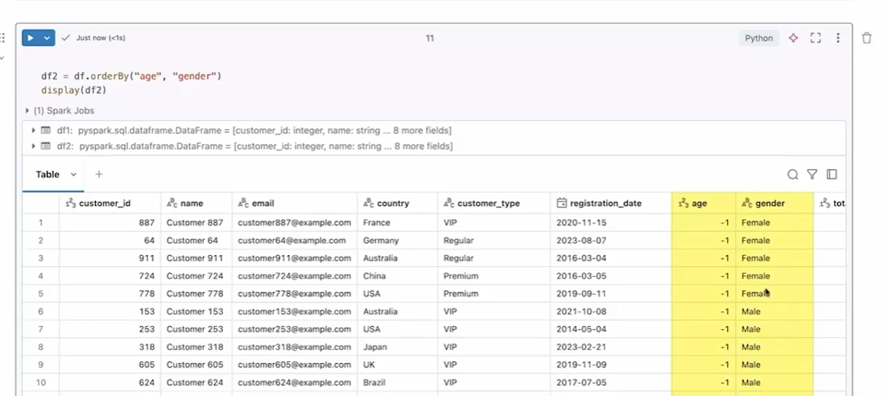

- **Descending order:**

  - Use **desc()** (import from pyspark.sql.functions)

  - Example: df.orderBy(desc("age"))

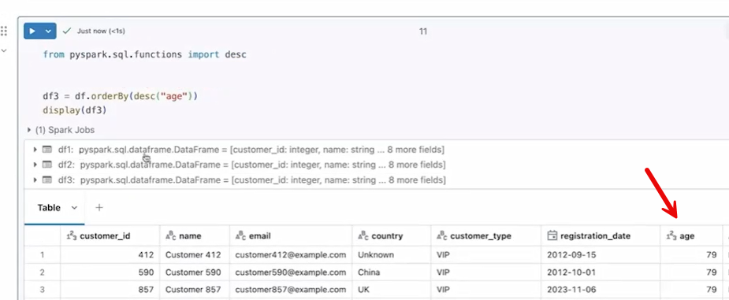

- **Mixed sorting:**

  - Combine ascending and descending:

    - Example: df.orderBy(desc("age"), "gender")

    - Age → descending, Gender → ascending

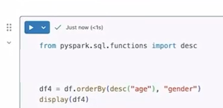

- **Handling null values:**

  - Control null placement using:

    - asc_nulls_first() / asc_nulls_last()

    - desc_nulls_first() / desc_nulls_last()

  - Example: col("email").asc_nulls_first()

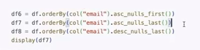

- **Key idea:**

  - orderBy() and sort() work the same way and allow flexible sorting,
    including control over null handling.

**Overall:**  
These functions help organize data for better analysis by sorting on one
or more columns with customizable order and null behavior.

## 4.7 Use groupBy and aggregation in PySpark

A lesson on **groupBy and aggregation in PySpark**:

- **Grouping data:**

  - Use **groupBy()** to group rows based on one or more columns.

  - Example: df.groupBy("gender").count() → count per gender

  - Multiple columns: df.groupBy("gender", "customer_type")

- **Basic aggregations:**

  - Apply functions like:

    - **count()**

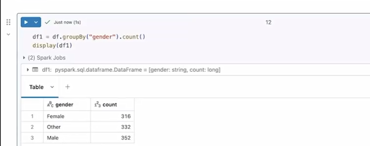

- **sum()**

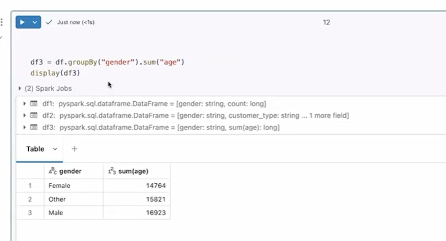

- **max()**

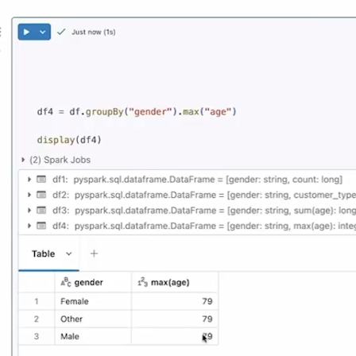

- **min()**

> 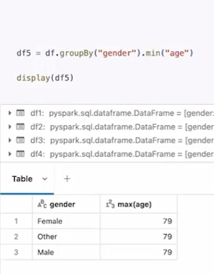 alt="Table AI-generated content may be incorrect." />

- **avg()**

> 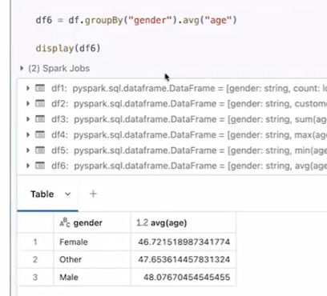 style="width:4.9913in;height:4.52642in" />

- Requires importing from pyspark.sql.functions

<!-- -->

- **Multiple aggregations together:**

  - Use **agg()** to perform multiple calculations at once:

    - Example: sum, max, min, and average in a single DataFrame

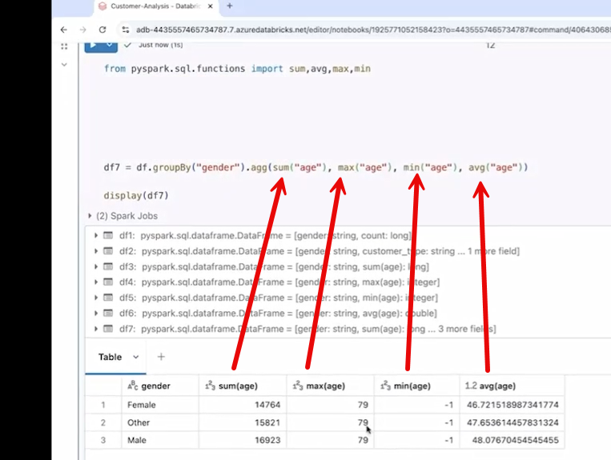

- **Improving readability:**

  - Use **.alias()** to rename output columns (e.g., “Sum”, “Highest”,
    “Average”)

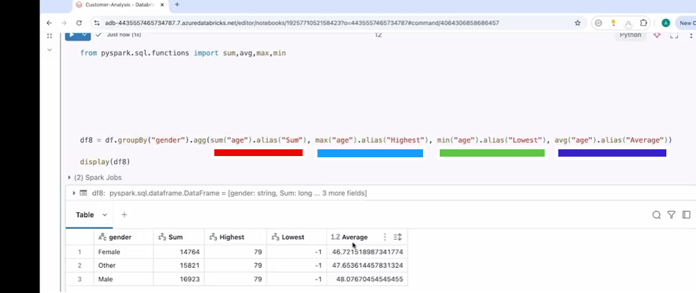

- **Key idea:**

  - groupBy() organizes data into categories, and aggregation functions
    summarize those groups.

**Overall:**  
Grouping and aggregation are essential for analyzing data patterns,
enabling summaries like counts, totals, and averages across categories.

## 4.8 Manipulate strings in PySpark

A lesson on **string manipulation in PySpark**:

- **Case conversion:**

  - Use **upper()** → convert to uppercase

> 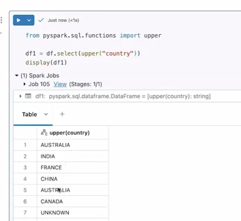 alt="Graphical user interface, text, application, email AI-generated content may be incorrect." />

- Use **lower()** → convert to lowercase

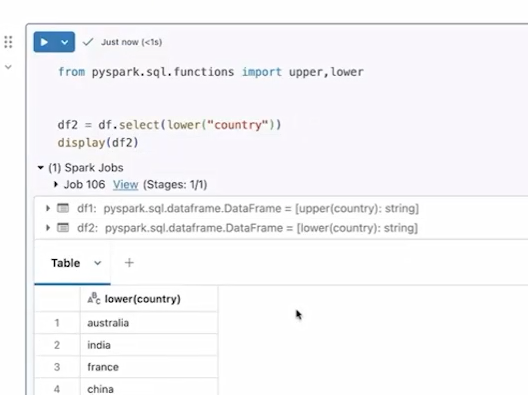

- **Trimming spaces:**

  - **ltrim()** → remove leading spaces

  - **rtrim()** → remove trailing spaces

  - **trim()** → remove spaces from both sides

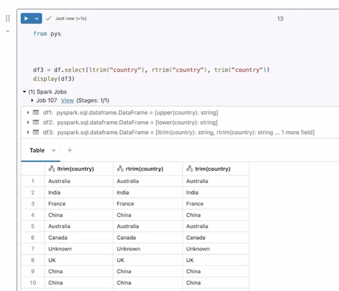

- **Replacing text:**

  - Use **regex_replace()** to replace specific substrings

  - Example: replace "Unknown" with "Not Sure"

> 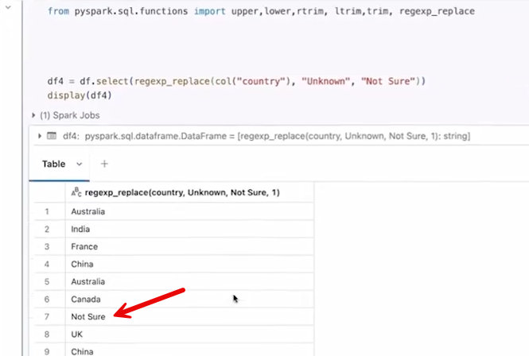 alt="Graphical user interface, application AI-generated content may be incorrect." />

- **Splitting strings:**

  - Use **split()** to divide strings (e.g., email by "@")

  - Can extract parts using index (like arrays)

> 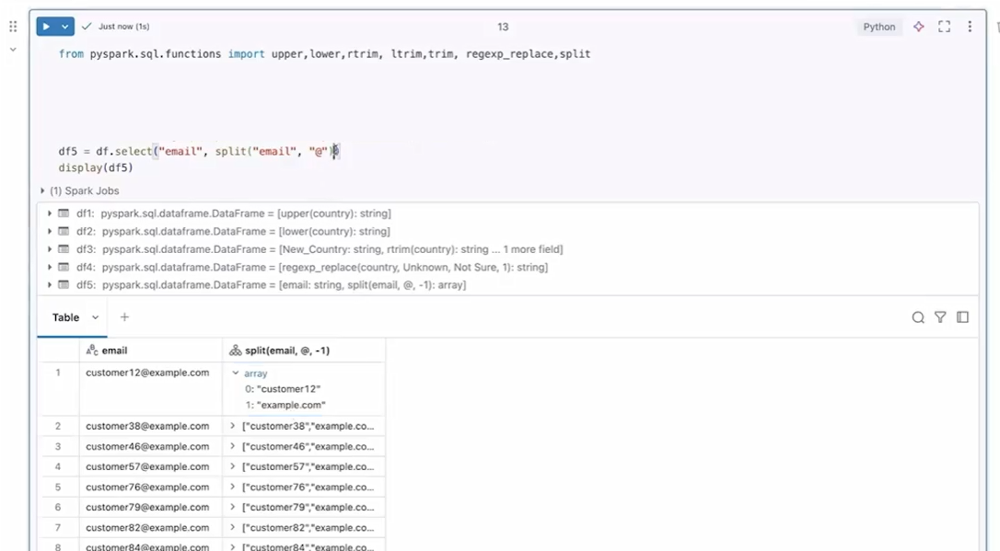 alt="Graphical user interface, text, application, email AI-generated content may be incorrect." />

- **Searching within strings:**

  - Use **contains()** to check if a substring exists

  - Returns true/false

> 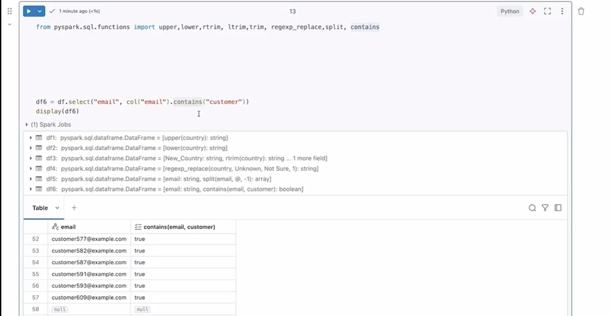 alt="Graphical user interface, text, application, email AI-generated content may be incorrect." />

- **String length:**

  - Use **length()** to count characters

> 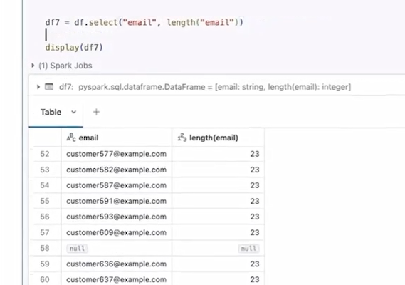 style="width:5.14198in;height:3.61475in" />

- **Concatenation:**

  - Use **concat()** → combine columns

  - Use **concat_ws()** → combine with a separator

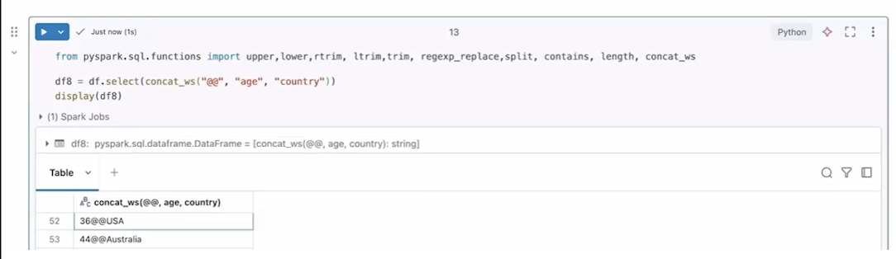

- **Key idea:**

  - PySpark provides powerful built-in functions to clean, transform,
    and analyze string data efficiently.

**Overall:**  
String manipulation is essential in data engineering, and PySpark offers
flexible tools for formatting, cleaning, and extracting information from
text data.

**Notes:**

In PySpark, you can apply both upper and trim inside a select using
functions from pyspark.sql.functions.

Here’s the clean way to do it:

``` python

from pyspark.sql import functions as F

df.select(

F.upper(F.trim(F.col("your_column"))).alias("cleaned_column")

)

```

**Example**

``` python

from pyspark.sql import SparkSession  
from pyspark.sql import functions as F  
  
spark = SparkSession.builder.getOrCreate()  
  
data = \[(" hello ",), (" world ",)\]  
df = spark.createDataFrame(data, \["text"\])  
  
df.select(  
F.upper(F.trim(F.col("text"))).alias("text_clean")  
).show()

```

**Output**

```

+----------+

\|text_clean\|

+----------+

\| HELLO\|

\| WORLD\|

+----------+

```

**Tip**

You can apply this to multiple columns:

``` python

df.select(

F.upper(F.trim(F.col("col1"))).alias("col1"),

F.upper(F.trim(F.col("col2"))).alias("col2")

)

```

Top of Form

Bottom of Form

## 4.9 Handle date manipulation in PySpark

A lesson on **date manipulation in PySpark**:

- **Extracting date parts:**

  - Use functions like:

    - **year()**, **month()**, **dayofmonth()**

    - **dayofweek()**, **dayofyear()**, **weekofyear()**, **quarter()**

  - Helps break a date into useful components for analysis.

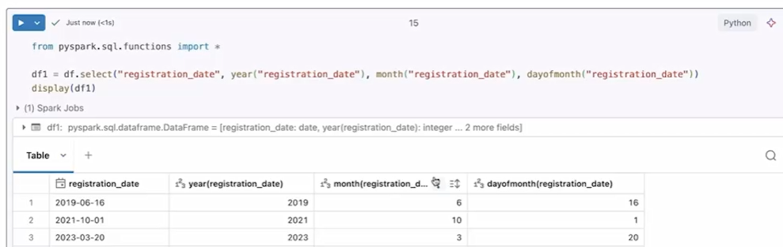

- **Date arithmetic:**

  - Use **date_add()** → add days

  - Use **date_sub()** → subtract days

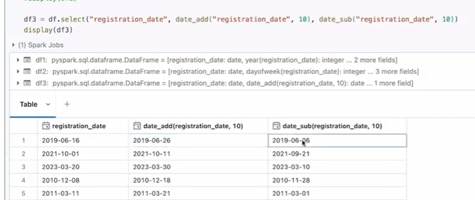

- **Formatting dates:**

  - Use **date_format()** to convert dates into custom formats

  - Example: "MMMM dd, yyyy"

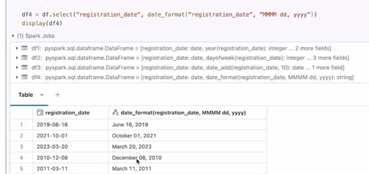

- **Current date:**

  - Use **current_date()** to get today’s date

  - Can combine with **limit(1)** to show a single row

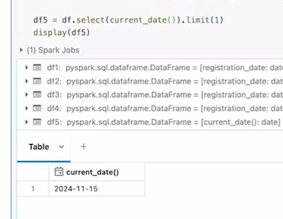

- **Key idea:**

  - PySpark provides built-in functions to extract, modify, and format
    date values efficiently.

**Overall:**  
Date manipulation is essential for time-based analysis, and PySpark
offers flexible tools for extracting components, performing
calculations, and formatting dates.

## 4.10 Handle timestamp manipulation in PySpark

A lesson on **timestamp manipulation in PySpark**:

- **Extracting components from timestamp:**

  - Similar to dates, you can extract:

    - **year()**, **month()**, **dayofmonth()**

    - Additional fields: **hour()**, **minute()**, **second()**

> 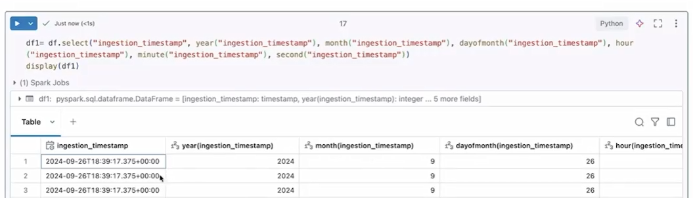 alt="Table AI-generated content may be incorrect." />

- **Current timestamp:**

  - Use **current_timestamp()** to get the current date and time

> 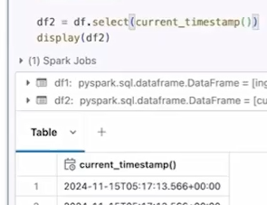 alt="Graphical user interface, application AI-generated content may be incorrect." />

- **Calculating differences:**

  - Use **datediff()** to find the difference (in days) between two
    timestamps

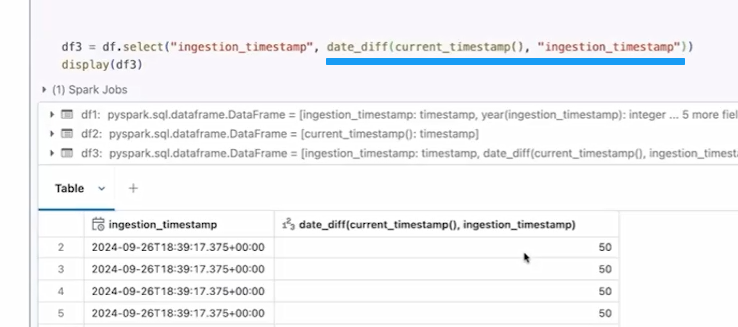

- **Key idea:**

  - Timestamp functions extend date capabilities by including time
    components like hours, minutes, and seconds.

**Overall:**  
PySpark provides powerful tools to extract, compare, and analyze
timestamp data, enabling precise time-based operations in data
engineering workflows.


# [Context](./../context.md)