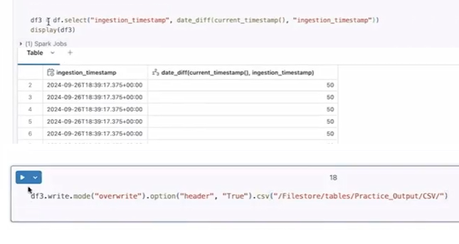
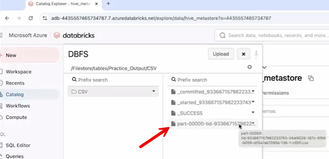
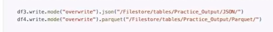
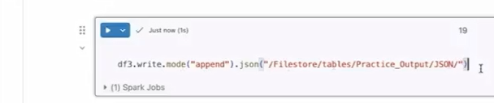
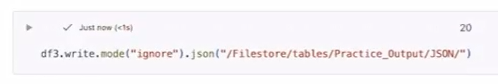
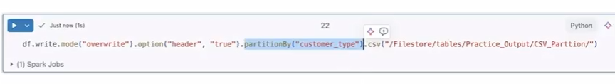
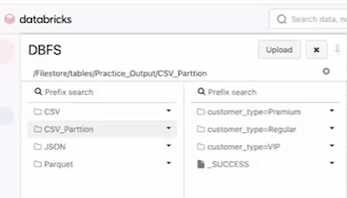
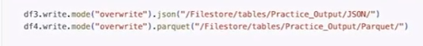

# **5. Write a DataFrame in Databricks**

## 5.1 Write a DataFrame as a file in DBFS

**Writing a DataFrame to DBFS (Databricks File System)**

You can save a Spark DataFrame to DBFS using the .write method in
different file formats and modes.

------------------------------------------------------------------------

**Basic Syntax**

**Python**

``` python

df.write.mode("mode_name").format("file_format").save("path")

```

Or format-specific:

**Python**

``` python

df.write.mode("overwrite").csv("dbfs:/FileStore/tables/output")

```





------------------------------------------------------------------------

**Supported File Formats**

- **CSV**

  - Optionally include header:

**Python**

``` python

df.write.mode("overwrite").option("header", "true").csv(path)

```

- **JSON**

  - No header needed:
  
**Python**

``` python

df.write.mode("overwrite").json(path)

```

- **Parquet**

  - Efficient, columnar format:

**Python**

``` python

df.write.mode("overwrite").parquet(path)

```

------------------------------------------------------------------------

**Write Modes Explained**

1.  **overwrite (default)**

    - Deletes existing data in the path and rewrites it.

    - Use when you want a fresh output.



2.  **append**

    - Adds new data to existing files.

    - Creates additional files in the same folder.



3.  **ignore**

    - Does nothing if the target path already exists.

    - No error, just skips writing.



4.  **error / errorIfExists**

    - Throws an error if the path already contains data.

------------------------------------------------------------------------

**How Output Looks in DBFS**

- Files are stored as **multiple part files** (e.g., part-00000...)

- You can browse them via:

  - **DBFS → FileStore → tables → your folder**

------------------------------------------------------------------------

**Key Takeaways**

- Use .write to persist transformed DataFrames.

- Choose format based on use case (CSV, JSON, Parquet).

- Select the appropriate mode depending on whether you want to
  overwrite, append, ignore, or fail on existing data.

- Output is distributed into multiple files, not a single file.

## 5.2 Write a DataFrame as using partitioning

**Writing a DataFrame with Partitioning**

You can partition your output data while writing a DataFrame using
.partitionBy().

------------------------------------------------------------------------

**Basic Syntax**

**Python**

``` python

df.write  
.mode("overwrite")  
.option("header", "true")  
.partitionBy("column_name")  
.csv("dbfs:/FileStore/tables/output_path")

```



Within that, you have three different folders. Why? Because we tried to
partition it based on the customer type. So, whatever the number of
unique values we have in this specific column, that many folders will
get created. So, so far in our customer type, we have three unique
values: **premium, regular, and VIP**. That is why three different
folders get created, and all the records for which the customer type is
premium is available within this specific file.



------------------------------------------------------------------------

**How Partitioning Works**

- Data is split into **separate folders based on unique values** of the
  chosen column.

- Example:

  - If partitioning by customer_type (VIP, Premium, Regular):

**Output:**


``` txt
Output:  
customer_type=VIP  
customer_type=Premium  
customer_type=Regular

```

- Each folder contains only records for that specific value.

------------------------------------------------------------------------

**Key Benefits**

- 🚀 **Improved query performance**

  - Queries filter only relevant partitions instead of scanning all
    data.

- 📂 **Efficient data organization**

  - Logical grouping of data by key columns.

------------------------------------------------------------------------

**When to Use Partitioning**

- Partition by columns frequently used in **filters**, such as:

  - date

  - country

  - customer_type

------------------------------------------------------------------------

**Important Notes**

- Number of partitions = **number of unique values** in the column.

- Too many unique values → too many folders (can hurt performance).

- Works with all formats: **CSV, JSON, Parquet**

>  style="width:6.26836in;height:0.68211in" />

------------------------------------------------------------------------

**Example (JSON with Partitioning)**

**Python**
``` python

df.write  
.mode("overwrite")  
.partitionBy("country")  
.json("dbfs:/FileStore/tables/json_partition")

```

------------------------------------------------------------------------

**Key Takeaway**

Partitioning organizes data into folders by column values, making
filtering faster and more efficient—especially for large datasets.

# [Context](./../context.md)