# **6. Spark SQL in Databricks**

6.1 What is Spark SQL?

**What is Spark SQL?**

- **Spark SQL** is a module in Apache Spark that lets you process,
  clean, and analyze data using **SQL-like queries**.

- It runs on top of Spark’s **distributed computing engine**, so queries
  are scalable and high-performance.

------------------------------------------------------------------------

**Key Features**

- **SQL Query Interface**

  - Write familiar SQL queries (e.g., SELECT \* FROM table)

- **Unified Data Access**

  - Works with structured, semi-structured, and unstructured data (CSV,
    JSON, Parquet, etc.)

- **Integration with DataFrames**

  - Can combine SQL queries with DataFrame APIs

- **Catalyst Optimizer**

  - Automatically optimizes queries for better performance

- **Schema Enforcement**

  - Ensures data consistency by validating structure

------------------------------------------------------------------------

**Why Use Spark SQL?**

- ✅ **Easy to use** (especially for SQL users)

- 🚀 **Scalable** (works the same for small and huge datasets)

- 🔗 **Integrates with big data systems** (HDFS, Spark ecosystem)

- ⚡ **High performance** (comparable to DataFrames)

- 🔄 **Flexible** (mix SQL + DataFrame operations)

------------------------------------------------------------------------

**Limitations**

- ⏱️ Slight **latency for small datasets/queries**

- ⚙️ For **complex transformations**, DataFrame API may be better

------------------------------------------------------------------------

**Key Takeaway**

Spark SQL lets you write **SQL-style queries on big data**, combining
ease of use with the power of distributed processing.

6.2 Create temporary views in Databricks

**What is a Temporary View?**

- A **temporary view** is a **session-scoped table-like structure**
  created from a DataFrame.

- It allows you to query DataFrames using **SQL syntax**.

------------------------------------------------------------------------

**Key Characteristics**

- 🕒 **Session-scoped** → Exists only during the current
  session/notebook run

- 💾 **In-memory** → Not stored on disk

- 🔄 **Temporary** → Automatically deleted when:

  - Session ends

  - Cluster restarts

------------------------------------------------------------------------

**Why Use Temporary Views?**

- Enables **SQL-based analysis on DataFrames**

- Useful for **ad hoc analysis and transformations**

- Bridges **PySpark and SQL**

- Common in **ETL intermediate steps**

------------------------------------------------------------------------

**How to Create**

**Get data**

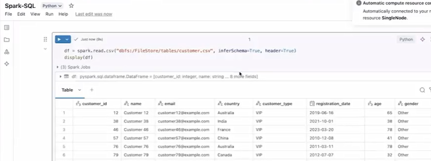

**Python**

``` python

df.createOrReplaceTempView("view_name")

```

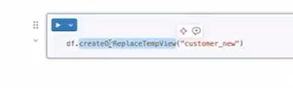

Alternative:

**Python**

``` python

df.createTempView("view_name") \# errors if already exists

```

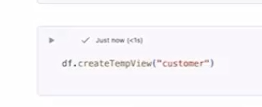

------------------------------------------------------------------------

**Using the View**

**SQL**

``` sql

spark.sql("SELECT * FROM view_name")

```

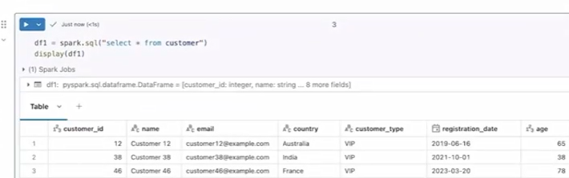

------------------------------------------------------------------------

**Managing Views**

- **List views**

**Python**

``` python

spark.sql("SHOW VIEWS")

```

- **Drop a view**

**Python**

``` python

spark.sql("DROP VIEW view_name")

```

------------------------------------------------------------------------

**Limitations**

- ❌ Not persistent (lost after session ends)

- ❌ Cannot be shared across notebooks

- ❌ No indexing for performance

------------------------------------------------------------------------

**Key Takeaway**

Temporary views let you **query DataFrames using SQL easily**, but they
are **short-lived and session-specific**.

6.3 Create global temp views in Databricks

**Global Temporary Views in Databricks**

- Global temporary views are similar to temporary views but **accessible
  across all sessions and notebooks within the same Spark application**.

- They are **application-wide**, meaning multiple users or notebooks can
  query them simultaneously.

- These views are stored in a special database called **global_temp**,
  so you must reference them as:  
  global_temp.view_name

- Like temporary views, they are **stored in memory (not on disk)** and
  are **not permanent**.

- They are **automatically dropped when the Spark application ends**
  (e.g., cluster restart).

**Creating Global Temporary Views**

- Use: df.createGlobalTempView("view_name")

- Or to avoid errors if it already exists:  
  df.createOrReplaceGlobalTempView("view_name")

**Querying**

- Must include the database:  
  SELECT \* FROM global_temp.view_name

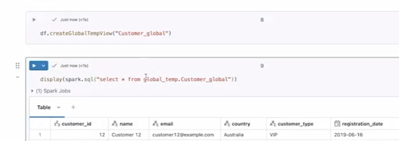

**Managing Views**

- List all global temp views:  
  SHOW VIEWS IN global_temp

> 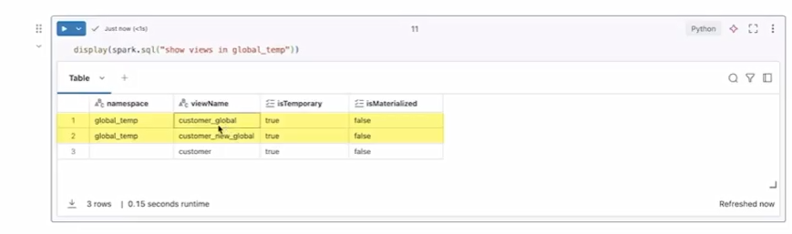 alt="Graphical user interface, application, table AI-generated content may be incorrect." />

- Drop a view:  
  DROP VIEW global_temp.view_name

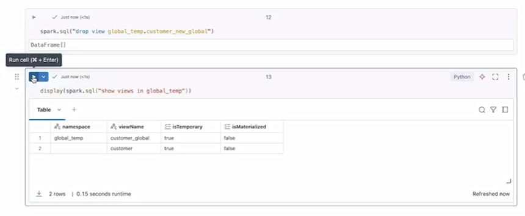

**Key Difference from Temporary Views**

- Temporary views: session-specific

- Global temporary views: **shared across sessions within the same
  application**

6.4 Use Spark SQL transformations

**Spark SQL Transformations**

- Spark SQL allows data engineers to **query, clean, transform, and
  aggregate data using familiar SQL syntax** on DataFrames and views.

- Queries are executed using spark.sql(), and the result is always
  returned as a **DataFrame**.

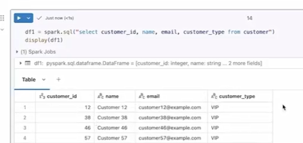

**Key Capabilities**

- **Selecting columns:**  
  Use standard SQL (SELECT column1, column2 FROM view) to retrieve
  specific fields.

- **Filtering data:**  
  Apply conditions with WHERE, including **AND/OR logic**, just like
  traditional SQL.

> 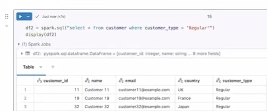 style="width:5.91866in;height:2.46338in" />
>
> 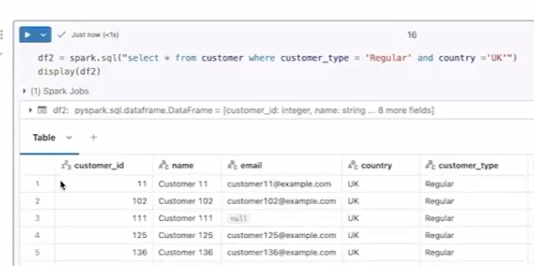 style="width:5.61619in;height:2.79758in" />

- **Aggregation & Grouping:**  
  Use functions like COUNT() with GROUP BY to summarize data.

> 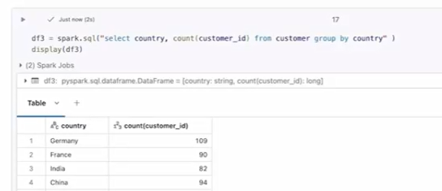 alt="Graphical user interface, table AI-generated content may be incorrect." />
>
> 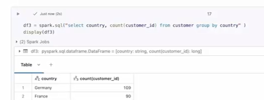 alt="Graphical user interface, application AI-generated content may be incorrect." />

- **Aliases:**  
  Rename columns using AS for better readability.

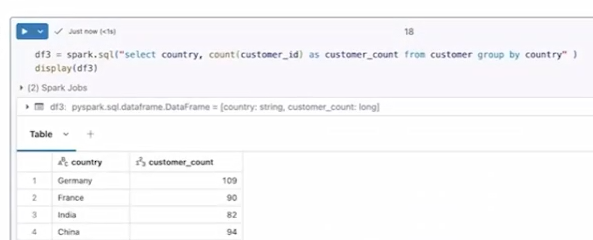

- **Sorting:**  
  Use ORDER BY with ASC (default) or DESC to control result order.

- **Distinct values:**  
  Use SELECT DISTINCT to get unique records.

**Additional Operations**

- Supports common SQL operations like **joins, unions, and distincts**,
  making it very flexible.

**Key Advantage**

- Enables users to work with big data using **familiar SQL instead of
  complex PySpark code**, reducing the learning curve and improving
  productivity.

6.5 Write DataFrames as managed tables in PySpark

**Writing DataFrames as Managed Tables in PySpark**

- A **managed table** in PySpark/Databricks is a table where
  **Databricks manages both the data and metadata** (schema, table name,
  etc.).

**Key Characteristics**

- Data is stored in a **default location**:  
  /user/hive/warehouse/table_name (unless a database is specified).

- The table is **registered in the metastore**, making it accessible
  across the workspace.

- If the table is **dropped, both data and metadata are deleted**
  automatically.

- Data is typically stored in **Parquet format** by default.

**How to Create a Managed Table**

- Use:

**Python**

``` python

df.write.mode("overwrite").saveAsTable("table_name")

```

- This creates a table instead of just saving files (unlike .save()).

**Querying the Table**

- Use Spark SQL:

**SQL**

``` sql

spark.sql("SELECT * FROM table_name")

```

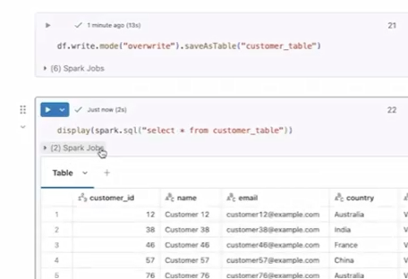

**Inspecting Table Details**

- Use:

``` sql

DESCRIBE EXTENDED table_name

```

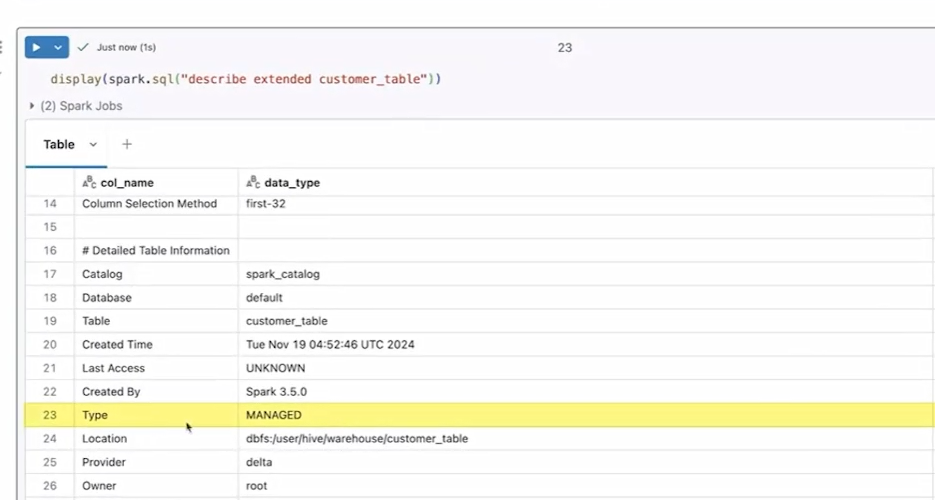

- Shows schema, type (**MANAGED**), and storage location.

**Dropping the Table**

- Use:

- 

``` sql

DROP TABLE table_name

```

- This deletes both the **table metadata and underlying data files**.

**Advantages**

- Easy to use (similar to traditional SQL tables)

- Databricks handles the full lifecycle of data and metadata

**Key Idea**

- Managed tables are **fully controlled by Databricks**, making them
  simple but less flexible if you want to retain data independently
  (handled by external tables).

6.6 Write a DataFrame as external table in PySpark

**Writing DataFrames as External Tables in PySpark**

- An **external table** is a table where **Databricks manages only the
  metadata**, while the **actual data is stored in an external
  location** (e.g., DBFS, Azure Data Lake, AWS S3, Google Cloud
  Storage).

**Key Characteristics**

- Metadata (table name, schema, etc.) is stored in the **Databricks
  metastore**.

- Data remains in a **user-specified external path**.

- **Dropping the table deletes only metadata**, not the underlying data.

- Supports multiple formats like **Parquet, Delta, CSV, JSON**.

**How to Create an External Table**

- Specify a path while writing:

**Python**

``` python

df.write.mode("overwrite")  
.option("path", "external_table/data")  
.saveAsTable("customer_ext_table")

```

- Adding the path option makes it an **external table**.

**Querying the Table**

- Use:

**Python**

``` python

spark.sql("SELECT * FROM customer_ext_table")

```

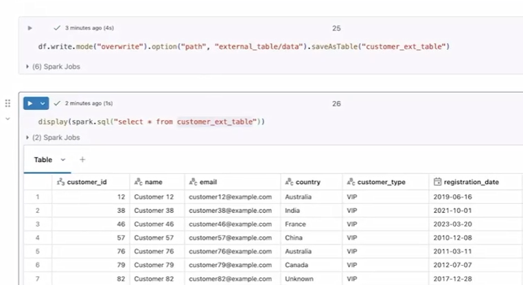

**Inspecting Table Details**

- Use:

**SQL**

``` sql

DESCRIBE EXTENDED customer_ext_table

```

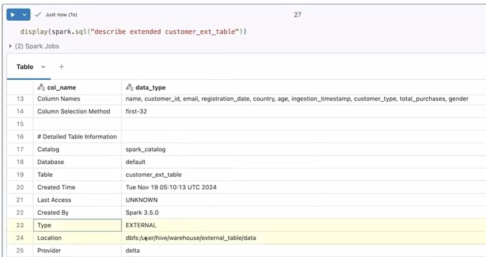

- Shows table type (**EXTERNAL**) and the custom path.

**Key Advantages**

- **Data independence** (data not deleted with table)

- **Shared access** (multiple tables/users can use same data)

- **Flexible storage integration** with data lakes

**Key Difference from Managed Tables**

- Managed table: Databricks controls **data + metadata** (data deleted
  on drop)

- External table: Databricks controls **only metadata** (data persists
  after drop)

**Bottom line:** External tables give you **control and safety over your
data**, while still allowing SQL-based access through Databricks.


# [Context](./../context.md)