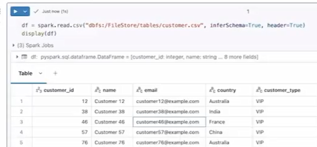
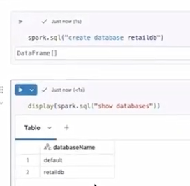
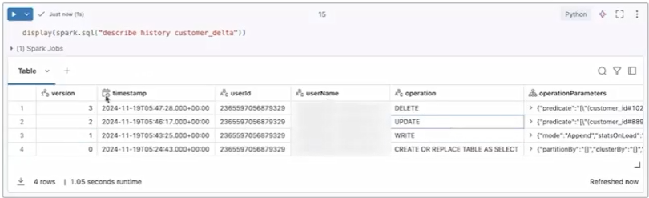
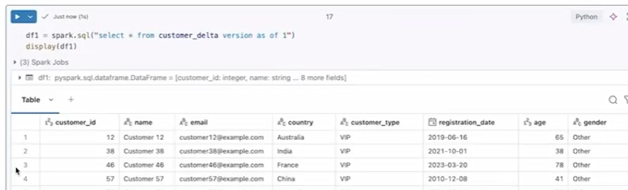
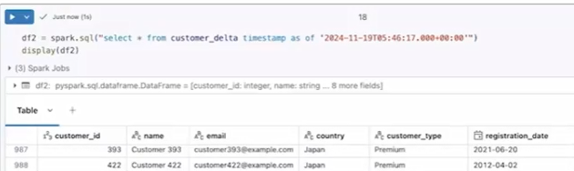
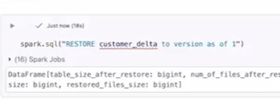

**7. Delta Lake and Delta Tables in Databricks**

**7.1 What is Delta and its benefits?**

**What is Delta Lake?**

- **Delta Lake** is an **open-source storage layer** built on top of
  data lakes that adds **reliability and advanced features** like **ACID
  transactions** and schema management.

  - ACID transactions are a set of four key properties—Atomicity,
    Consistency, Isolation, and Durability—that guarantee database
    reliability and data integrity, even during failures or concurrent
    access.

> **The ACID Components:**

- **Atomicity:** Ensures all operations within a transaction are
  completed; if one fails, the entire transaction is aborted and rolled
  back.

- **Consistency:** Guarantees that a transaction transforms the database
  from one valid state to another, upholding all predefined rules,
  constraints, and cascades.

- **Isolation:** Ensures that multiple transactions occurring
  simultaneously do not interfere with one another, preventing
  intermediate, uncommitted data from being visible to others.

- **Durability:** Guarantees that once a transaction is committed, its
  changes are permanently recorded, even in the event of a system crash
  or power loss.

- It enables a **data lakehouse architecture**, combining the
  flexibility of data lakes with the reliability of data warehouses.

- It supports both **batch and streaming processing in a unified
  system**.

**Key Features**

- **ACID Transactions:** Ensures reliable reads/writes even with
  concurrent operations.

- **Schema Enforcement & Evolution:**

  - Enforces data quality (correct schema)

  - Allows schema changes over time (new columns, changes)

- **Time Travel:** Access or restore previous versions of data.

- **DML Operations:** Supports **INSERT, UPDATE, DELETE, UPSERT** (not
  available in basic Spark tables).

- **High Performance:** Optimizations like compaction and indexing
  improve large-scale queries.

------------------------------------------------------------------------

**Benefits**

- **Data reliability** through ACID guarantees

- **Flexibility** with schema changes

- **Historical tracking** via time travel

- **Improved performance** for large datasets

- **Unified processing** for batch + streaming

------------------------------------------------------------------------

**Common Use Cases**

- **ETL pipelines** requiring reliable data processing

- **Real-time + batch data processing systems**

- **Modern data warehouses / lakehouse architectures**

------------------------------------------------------------------------

**Bottom line:** Delta Lake transforms a traditional data lake into a
**reliable, scalable, and high-performance data platform** suitable for
modern data engineering needs.

**7.2 Create Delta tables**

**Creating Delta Tables in PySpark**

- To create a **Delta table**, you first need a **DataFrame** (e.g.,
  read from a CSV using spark.read.csv).

------------------------------------------------------------------------

**Steps to Create a Delta Table**

1.  **Load Data into a DataFrame**

**Python**

``` python

df = spark.read.csv(path, inferSchema=True, header=True)

```



2.  **(Optional) Create a Database**

**Python**

``` python

spark.sql("CREATE DATABASE retaildb")

```



3.  **Write DataFrame as a Delta Table**

**Python**

``` python

df.write.mode("overwrite")  
.format("delta")  
.saveAsTable("table_name")

```

4.  **To create in a specific database**

**Python**

``` python

df.write.mode("overwrite")  
.format("delta")  
.saveAsTable("retaildb.customer_delta")

```

------------------------------------------------------------------------

**Verifying the Table**

- Check details:

**SQL**

``` sql

DESCRIBE EXTENDED table_name

```

→ Confirms **provider = delta**

- List tables:

**SQL**

``` sql

SHOW TABLES

```

------------------------------------------------------------------------

**Storage Behavior**

- Tables are stored in DBFS under:

/user/hive/warehouse/\<database_name\>.db/\<table_name\>

- Creating a database creates a corresponding folder, and tables are
  stored inside it.

------------------------------------------------------------------------

**Key Idea**

- Creating a Delta table is similar to managed tables, but you specify:

.format("delta")

- This enables all **Delta Lake features** (ACID transactions, time
  travel, etc.).

------------------------------------------------------------------------

**Bottom line:** Delta tables are created by writing a DataFrame in
**Delta format**, optionally within a database, and stored in DBFS with
full Delta Lake capabilities.

**7.3 Handle DML operations in Delta**

**Handling DML Operations in Delta Tables**

- Unlike regular Spark tables, **Delta tables support DML operations**
  such as **INSERT, UPDATE, and DELETE** using SQL.

------------------------------------------------------------------------

**Key Operations**

- **Insert Data**

- 
**SQL**

``` sql

INSERT INTO table_name VALUES (...)

```

- Adds new rows to the Delta table.

<!-- -->

- **Update Data**

**Python**

``` python

UPDATE table_name  
SET column = value  
WHERE condition

```

- Modifies existing rows.

- ⚠️ Important: Always use a **WHERE clause** to avoid updating the
  entire table.

<!-- -->

- **Delete Data**

**Python**

``` python

DELETE FROM table_name  
WHERE condition

```

- Removes specific rows from the table.

------------------------------------------------------------------------

**Example Workflow**

- Start with a table (e.g., 1,000 rows)

- Insert a new row → total becomes 1,001

- Update that row → values change

- Delete that row → total returns to 1,000

------------------------------------------------------------------------

**Key Advantage**

- These operations are possible because Delta Lake provides **ACID
  transaction support**, ensuring reliable and consistent data changes.

------------------------------------------------------------------------

**Key Idea**

- Delta tables behave like traditional database tables, allowing **full
  CRUD operations** directly using SQL.

**7.4 Time travel using Delta Lake**

**Time Travel in Delta Lake**

- **Time travel** in Delta Lake allows you to **view, track, and restore
  previous versions** of a table.

- Every operation (CREATE, INSERT, UPDATE, DELETE) creates a new
  **version** of the table.

------------------------------------------------------------------------

**Viewing Table History**

- Use:

**SQL**

``` sql

DESCRIBE HISTORY table_name

```

- Shows:

  - Version numbers

  - Timestamps

  - User/actions (insert, update, delete)

  - Execution details



------------------------------------------------------------------------

**Accessing Previous Data**

- **By version**

**SQL**

``` sql

SELECT * FROM table_name VERSION AS OF n

```



- Retrieves table state at a specific version.

<!-- -->

- **By timestamp**

**SQL**

``` sql

SELECT * FROM table_name TIMESTAMP AS OF 'yyyy-mm-dd hh:mm:ss'

```



- Retrieves table state at a specific time.

------------------------------------------------------------------------

**Restoring a Table**

- You can revert the table to a previous version:

**SQL**

``` sql

RESTORE TABLE table_name TO VERSION AS OF n

```



- This resets the table to an earlier state (e.g., before a bad
  update/delete).

------------------------------------------------------------------------

**Key Benefits**

- Recover from accidental updates or deletions

- Track full change history

- Audit data changes over time

------------------------------------------------------------------------

**Key Idea**

- Delta Lake automatically maintains **versioned data**, enabling easy
  rollback and historical analysis.

------------------------------------------------------------------------

> **Bottom line:** Time travel makes Delta Lake highly reliable by
> allowing you to **inspect and restore past data states with ease**.


# [Content](./../content.md)