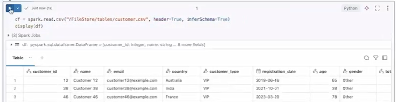
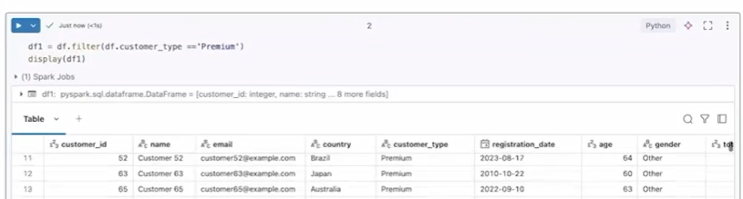
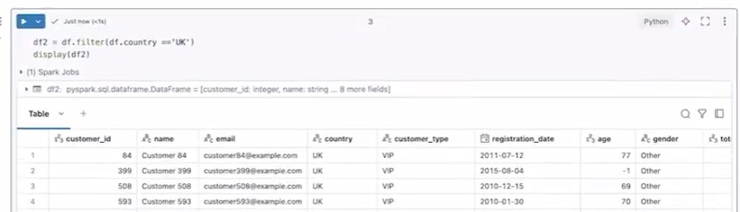
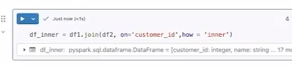
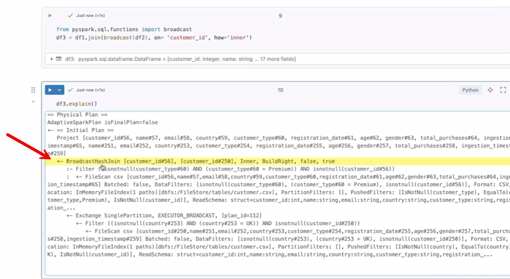
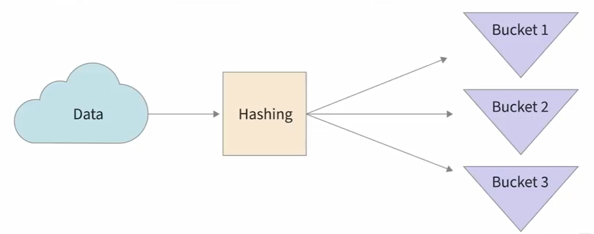

**8. Join Optimizations in Databricks**

8.1 Handle multiple types of join

**🔑 Key Idea**

Joins are essential in data engineering because they allow you to
combine data from multiple tables to solve real-world problems.

------------------------------------------------------------------------

**📊 Setup**

- Load a dataset (customer.csv) into a DataFrame.



- Create two filtered DataFrames:

  - **df1** → customers with customer_type = 'Premium'



- **df2** → customers where country = 'UK'



------------------------------------------------------------------------

**🔗 Join Syntax**

**Python**

``` python

df1.join(df2, on="customer_id", how="join_type")

```

- Use on="column" when both DataFrames share the same column name.

- Otherwise:

df1.column1 == df2.column2

**Python**

``` python

\# Join on customer_id AND an additional column equality condition

df1.join(df2, (df1.customer_id == df2.customer_id) & (df1.column1 ==
df2.column2), how="join_type")

```

------------------------------------------------------------------------

**🔄 Types of Joins**

**1. Inner Join**

**Python**

``` python

df_inner = df1.join(df2, on="customer_id", how="inner")

```



- Returns only matching rows from both DataFrames.

- Example: Customers who are **Premium AND in the UK**.

------------------------------------------------------------------------

**2. Left Join**

**Python**

``` python

df_left = df1.join(df2, on="customer_id", how="left")

```

- Returns all rows from **df1 (left)**.

- Matching rows from df2 are included; otherwise → null.

- Example: All Premium customers, with UK info if available.

------------------------------------------------------------------------

**3. Right Join**

**Python**

``` python

df_right = df1.join(df2, on="customer_id", how="right")

```

- Returns all rows from **df2 (right)**.

- Matching rows from df1 are included; otherwise → null.

**4. Full Outer Join**

**Python**

``` python

df_outer = df1.join(df2, on="customer_id", how="outer")

```

- Returns all rows from both DataFrames.

- Matches where possible; otherwise fills with null.

------------------------------------------------------------------------

**🧠 Key Takeaways**

- Joins combine datasets based on a common key.

- The how parameter defines the join behavior.

- Null values appear when no match is found (except in inner join).

- Record counts depend on which side (left/right) is preserved.

8.2 Broadcast join

**🔑 What is Broadcast Join?**

A **Broadcast Join** is a join strategy where the **smaller DataFrame is
sent (broadcasted) to all worker nodes**, instead of shuffling both
datasets.

------------------------------------------------------------------------

**⚙️ How It Works**

- One large DataFrame is distributed across partitions.

- The **smaller DataFrame is copied to every worker node**.

- Each node performs the join locally → **less data movement
  (shuffle)**.

------------------------------------------------------------------------

**🚀 Why Use It?**

- **Improves performance** by reducing shuffle.

- Only small data is transferred instead of large datasets.

- Faster joins, especially with uneven table sizes.

------------------------------------------------------------------------

**📌 When to Use**

- One DataFrame is **small enough to fit in executor memory**.

- Common scenarios:

  - Joining **fact (large) + dimension (small) tables**

  - Filtering large data using a **small list of keys/IDs**

  - Handling **data skew** when one table is much smaller

------------------------------------------------------------------------

**⚠️ Limitations**

- Only works if the broadcasted table is **small**.

- Broadcasting large tables can cause:

  - Memory issues

  - Execution failures

------------------------------------------------------------------------

**💻 Syntax**

**Python**

``` python

from pyspark.sql.functions import broadcast

df_join = df1.join(broadcast(df2), on="customer_id", how="inner")

```

- Wrap the **smaller DataFrame** with broadcast().

------------------------------------------------------------------------

**🔍 Execution Insight**

**Python**

``` python

df_join.explain()

```

- Shows the physical plan.

- Spark uses **BroadcastHashJoin** internally.

------------------------------------------------------------------------

**🧠 Key Takeaways**

- Broadcast the **smaller dataset**, not the large one.

- Reduces shuffle → faster joins.

- Best for **large + small table joins**.

- Always ensure the broadcasted data fits in memory.

8.3 Bucketing in PySpark

**🔑 What is Bucketing?**

Bucketing is a **data optimization technique** where a DataFrame is
split into a **fixed number of buckets (files)** based on a chosen
column (called the **bucket key**).

- Data is distributed using a **hash function** on the key column.

- Each row is assigned to a specific bucket.

- Each bucket is stored as a **separate file**.

------------------------------------------------------------------------

**⚙️ How It Works**

1.  Choose a **bucket key column** (e.g., customer_id, country).

2.  Decide the **number of buckets** (e.g., 4, 16).

3.  Apply a **hash function** on the key → assigns rows to buckets.

4.  Data is evenly distributed across buckets.

------------------------------------------------------------------------

**🚀 Benefits**

- **Improved performance**:

  - Reduces data shuffle during joins.

  - Faster aggregations and group operations.

- **Efficient joins**:

  - If two tables are bucketed on the **same key and same number of
    buckets**, joins are faster (bucket-to-bucket).



------------------------------------------------------------------------

**⚠️ Limitations**

- Bucket size/number is **fixed (static)**.

- Initial bucketing adds **overhead (shuffle during write)**.

- **Not automatic** → must be explicitly defined.

- For optimal joins:

  - Both tables must use **same bucket column and number of buckets**.

------------------------------------------------------------------------

**💻 Syntax**

**Python**

``` python

df.write  
.format("parquet")  
.bucketBy(4, "customer_id")  
.saveAsTable("customer_bucket")

```

- 4 → number of buckets

- "customer_id" → bucket key



------------------------------------------------------------------------

**🧠 Key Takeaways**

- Bucketing organizes data into **hash-based partitions (files)**.

- Best used for **frequent joins and aggregations**.

- Works best when multiple tables share the **same bucketing strategy**.

- Trade-off: **initial cost vs long-term performance gain**.

# [Content](./../content.md)